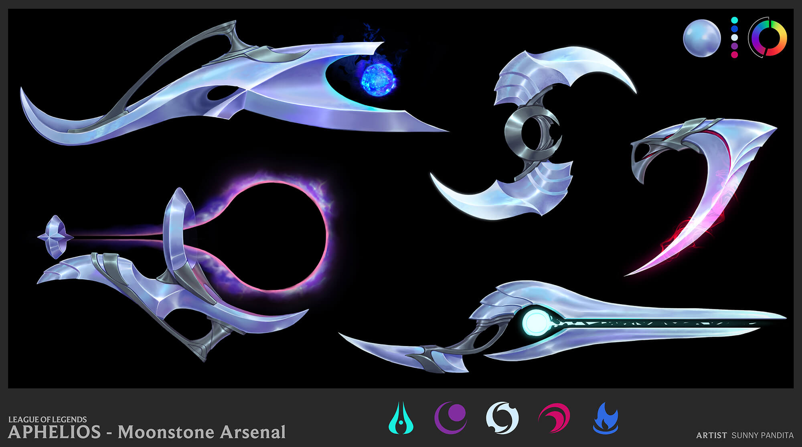
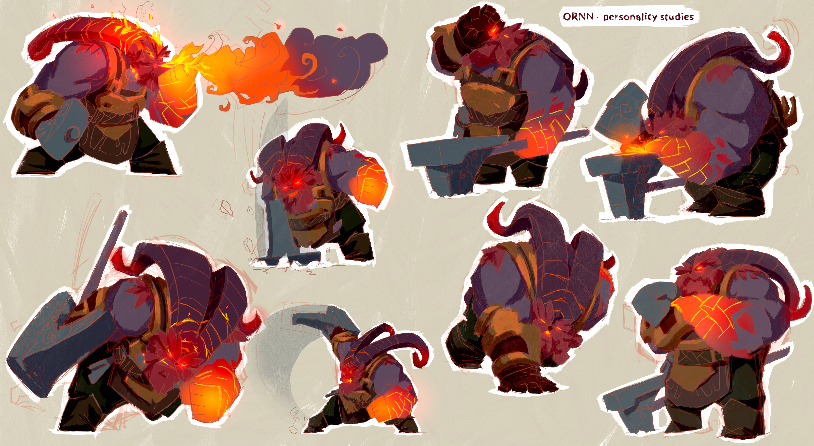
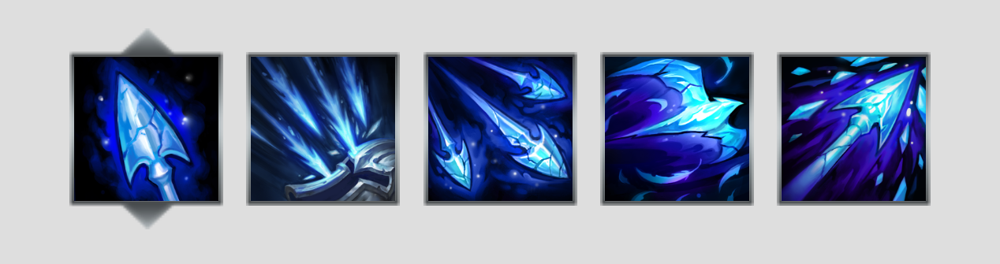
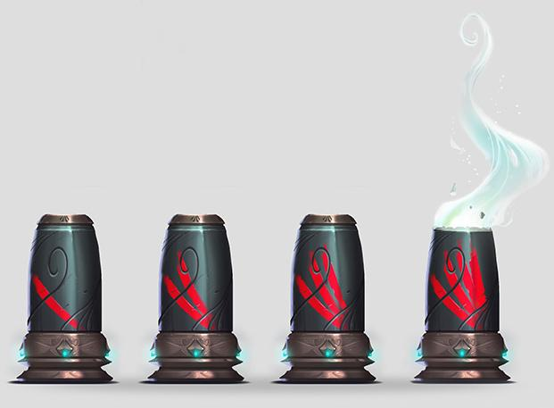
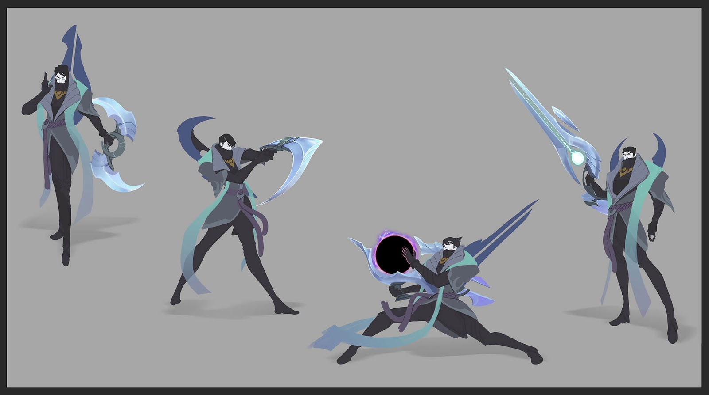

League of Legends's newest and "most complex" champion, Aphelios, was released on December 10th. With 5 different weapons available each with their own pros and cons, the champion can be confusing to play as, and equally confusing to play against. The Calibrum has long range, the Severum  provides healing, the Gravitum provides CC, the Infernum has excellent wave clear, and the Chakram gives massive close range DPS. Further more, Aphelios has an offhand weapon that affects the primary weapon ability's effect and he can swap the main and off-hand weapon at any time.

To put it in perspective, such a champion would have been unimaginable six years ago, when arguably the most complex champion at that time was Yasuo. Yasuo at that time still existed within the basic champions framework: abilities have one off effects that do not interact with each other (aside from his dash spin attack) nor the terrain. These abilities can slow, stun, knock-up, or nothing at all. Resource management remained simple, with either mana, some sort of meter that filled up, energy, or only cooldowns.

Where as many of the older champion's abilities are mix and matched from this basic toolset and might have one or two special characteristics involved, for example Twisted Fate's card pick mechanic, Jax's dodge, or Nidalee's transform, newer champions break completely from this framework. In many ways, the history of champion releases shows the growth of the champion team's vocabulary to craft champions with a certain playstyle or theme. There are more ways for abilities to interact with other abilities. The result are champions with a variety of playstyles and gameplay fantasies that are more intricate and powerful. You get to command soldiers with Azir, steal ultimates with Sylas, craft new items with Ornn, and fire powerful shots with Jhin.

What we see coinciding with this change is the growth in complexity for champion abilities. To offer these unique fantasies, these champions need specialized abilities that are unique from all other champions. I think it is surprising that these champions does not become overwhelming to learn to play as or against given their complexity, and I think there's a few reasons why:

League is actually just a rather generic game with some power budget that each champion must adhere to and relatively well explored range of playstyles. In broad strokes, a champion can spec into several categories. They can spec into health, damage, mobility, support, and crowd control. For example, ADC has almost everything put into damage, with each champion having slightly different specs in other stats. Ashe, or example, spec less in damage and more in crowd control and support. There's positioning that these champions perform their best no matter the complexity of their kit. With some exceptions, mages and marksmans wants to stay in the back line, assassins wants to dash in and out of the fight, etc. If you can identify which role these champions play as, then it is simple to decide a generic way to play against these champions.

<figure>
  
  <figcaption align="center"><i>Check out Ashe's frosty <a href="https://na.leagueoflegends.com/en/news/champions-skins/champion-update/champion-update-ashe-takes-aim-pbe">abilities</a></i></figcaption>
</figure>

The second is that the champion team often design specific power into a champion's kit in clear and reactable ways. Often gated by their cooldowns and resources, or simply within the abilities themselves (think about Aatrox's Q hitboxes), there are often mechanisms designed to make these champions weak/strong depending on how they decide to use their abilities. That's a reason why the 3 hit proc is so often used by the design team, it is a clear and generic way to make time dependent power that is gated by you landing your abilities, while ensuring that the player is committing sizable amount of their own resources to trigger that bonus damage and giving the enemy just enough time to respond. For example, the fastest way for Vayne to trigger silver bolt is AA E AA which requires a positioning mistake. Kennen's combo needs his empowered AA up which only happens once every 4th attack.

By keeping these two things in mind, it becomes rather simple to play as or against a complex kit. The 100 effects attached to each champion's ability simple defines a specified way to play as and against the champion. It matters less how exactly the damage dealt to you is calculated or what other passives it has (unless you are trying to calculate for specific power spikes, or really diving deep into the champion. In that case, you would be reading their ability description in detail anyways), but rather what should you do when seeing this champion on the rift.

Jhin's passive is a big long paragraph. But all this paragraph means is that you want to play around his the bonus damage on his fourth shot and the movement speed he gains afterwards. As an enemy, stay away from his 4th shot especially when you are low on health, and trade with him when he is reloading.

>Jhin's passive:
>
Jhin's hand cannon, Whisper, is a precise instrument designed to deal superior damage. It fires at a fixed rate and carries only four shots. Upon firing all four shots or not attacking for 10 seconds, Jhin has to reload for 2.5 seconds.
>
>Jhin imbues the final bullet with dark magics, guaranteeing it to critically strike and deal 15 / 20 / 25% of his target's missing Health as bonus physical damage. Against structures, the critical strike damage of this bullet is reduced by 44% and the bonus damage is not applied.
>
>Jhin's critical strikes deal 25% reduced damage, but grant 10% (+4% per 10% bonus attack speed) movement speed for 2 seconds.
>
>Additionally, Jhin's attack damage is increased by 4-44% (based on level) (+4% per 10% critical chance) (+2.5% per 10% bonus attack speed).

The interesting thing about Aphelios is that while he follows the above framework, the exact way to play against him is inconsistent with his 10 different weapon combinations. While there are lot of generalization on how to play as or against him in each combination (he has no dashes/blinks), there are still specific strength and weaknesses that both the player and the opponent have to exploit. You need to be aware of his heal and movement speed with Severum, his slow and snare with Gravitum, and his AOE damage with Infernum. Just as Aphelios might approach a fight differently with different weapons, his opponent also needs to respond accordingly. In that way, the enemies needs to be able to understand and respond to 10 slightly different version of a marksman to playing against Aphelios, and so requires them to have a more intimite knowledge of his kit than other champions.

State change champions are not new in League of Legends. Before the release of Aphelios, Riot have released Nidalee, Jayce, Gnar, Kled, Elise, Shyvana, and Qiyana. In that sense, Aphelios share the most in common with Gnar and Kled, whose transformations are "uncontrollable" and drastically changes their kit. While Aphelios' "transformations" are a lot tamer than Gnar and Kled, the sheer number of possible states makes Aphelios difficult to approach. Aphelios players will be the first ones to understand the benefits of each combination of weapons, and players playing against him will need to also understand the pros and cons of those 10 states. The sheer number of states makes it hard for enemy players to learn to deal the champion just through experience alone.

From Riot Stashu on the [Aphelios champion insight](https://nexus.leagueoflegends.com/en-us/2019/11/champion-insights-aphelios/):
>“One of the benefits of not being able to choose which weapon you have is that we could make the combination of his weapons super OP in different situations”

>"Because of the ammo, you force players into a scenario where they need to recognize their strengths at that exact moment. You can give them this combination of weapons that’s really strong for dueling so they think, ‘Oh damn. I have to fight RIGHT NOW."

However, he left out the point that the enemy also needs to be able to recognize those situations in order to play effectively against him.

In the end, although I think the champion team does a good job on making unique and rewarding champions that remain simple to play as or against despite their complexities, I'm not sure if there's a solution for Aphelios' case. The nature of his kit will make him one of the more complex champion to play against due to his varied strength and weaknesses depending on the weapons he has equipped.

Just because his state change nature is such a complex and important part of his kit, enemies will also need to understand how it functions in order to properly play against him. Just as any immobile marksmen, the general solution of course is to just delete him from the fight using crowd control and damage. However, the inconsistent way in which he has the ability to combat dive (Calibrum gives him range, Gravitum gives him slow/root, Severum gives him movemenet speed and sustain) will no doubt gives enemy frustrations when they do not understand what exactly to look out for. What Riot can only do is to give him more clarity, and be more clear on which weapons he has equipped and will be equipped, and the ammo count on each of those weapons. Fortunately, it looks like they are already looking into [it](https://twitter.com/MarkYetter/status/1207356431101358080).
