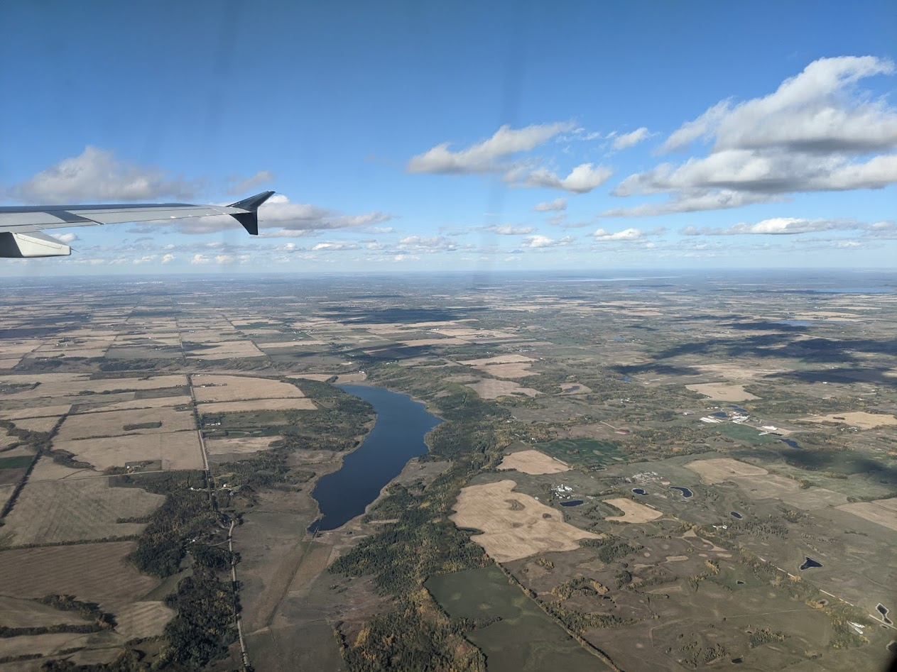
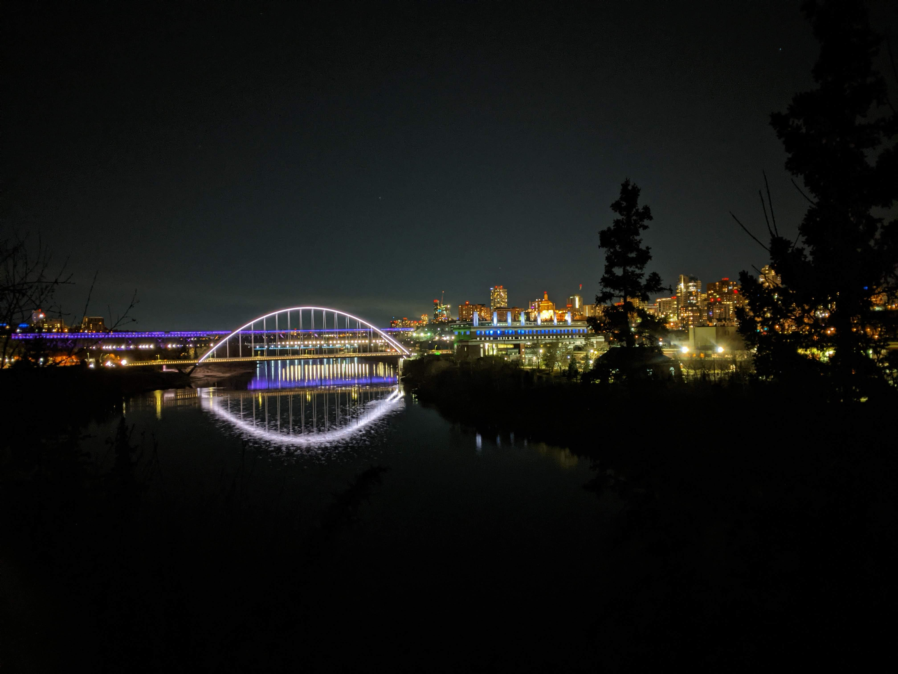
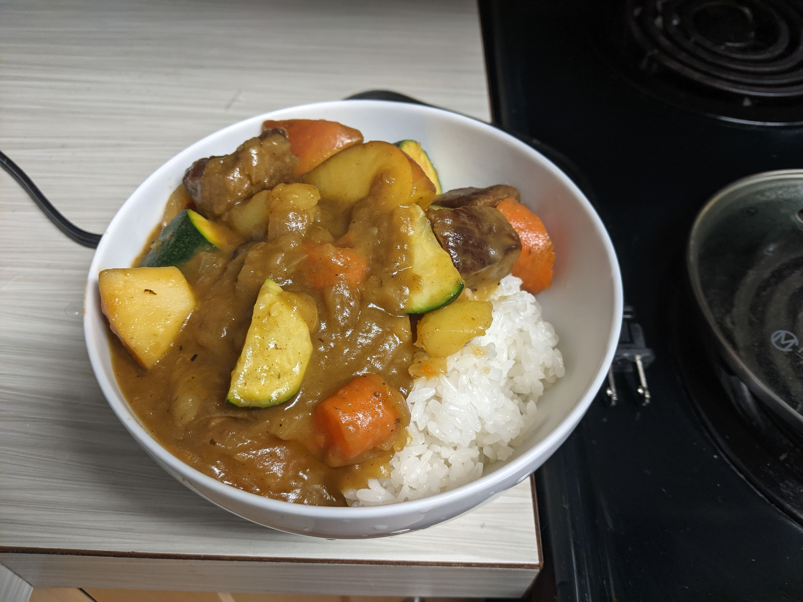
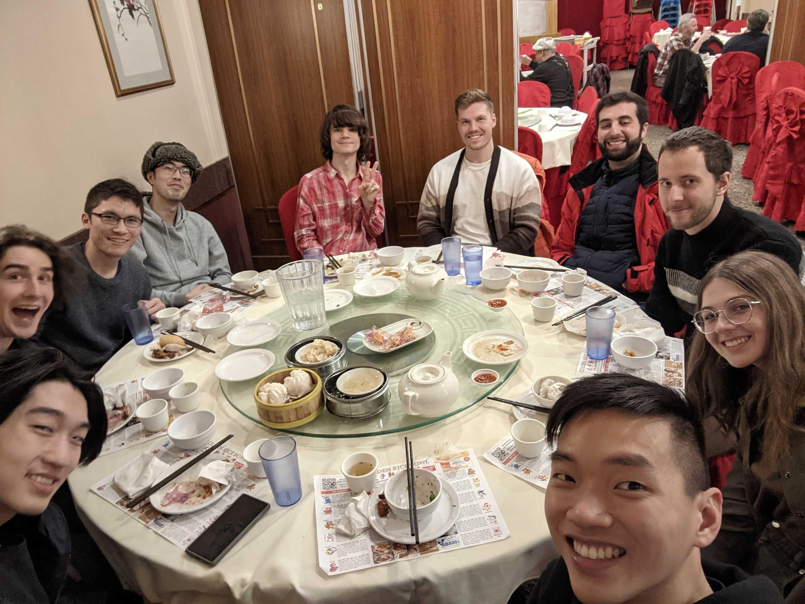
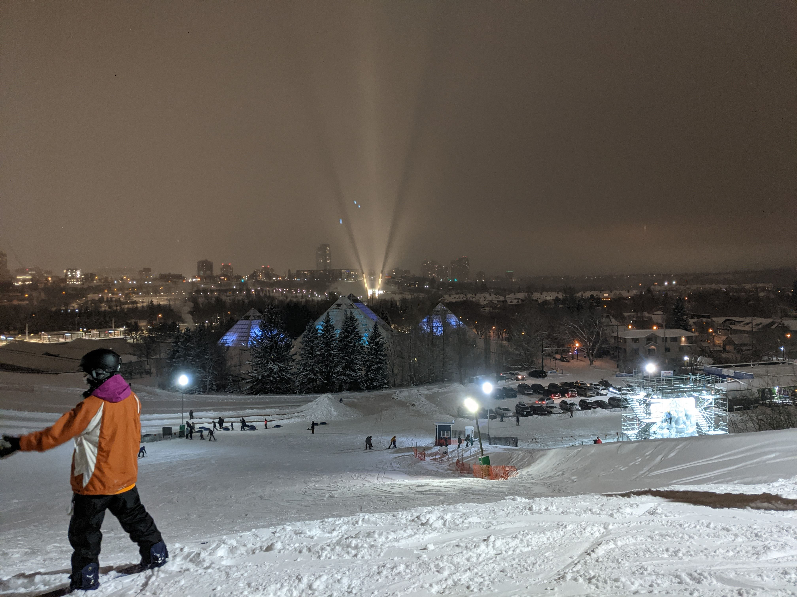

> This reflection piece was something I wrote in January 1st 2022 about my move to Edmonton. I've kind of forgotten about it until now, but much of what I wrote here is still rings true in December 2022, so I've decided to polish it up and post it!

As of writing, it's been a little over 3 months since coming to Edmonton. Moving out again after staying home for a year and a half was a big change and a big process. Now that I've settled in, and in the spirit of the new years to do a little bit of reflecting, I thought it'd be nice to finally polish up some thoughts I had about this whole process. TLDR, moving is chaotic, getting to meet people in person is a big change to the research experience, and Edmonton is pretty nice (also frozen)!

# Getting into Canada
One of my primary concern when crossing the border was the COVID restrictions. For anyone who didn't know, you are required to test negative for COVID within 72 hours before your flight. And oh god I was nervous when I took that test. I feel like is the time right before you leave that you go out the most, and have the most chance of getting COVID. You want to go see the people before you leave, you know? I went out with friends and went to their house for parties, we went out to eat at restaurants, and I even went to karaoke the weekend before my flight! I did take the usual precautions like wearing masks and cleaning my hands, but just being aware of how many chances you MIGHT have gotten COVID definitely made me nervous. 

Luckily, the border crossing was actually SUPER smooth. I just showed my ArriveCAN receipt, my vaccination record, and then I got led down hall after hall of empty hallways, where I sat for a bit waiting for my study permit. There was a scary and assertive lady there that handled everything professionally and managed the lines, and it was good! Since my flight got delayed from its original time, I got to campus after the resident office had already closed, which had me a little bit scared actually. The place that I thought I should pick up my keys from turns out doesn't actually have my keys (for the record it was Lister and I had no clue the keys were in their respective housing office, though I probably could have guessed. It's late, and it was the only place that was open, so I took the blind leap of faith :P). Luckily, the RA on duty was able to move me in after hours! Though I did have a small heart attack. I had to wait until the RA actually went on duty at 7pm though, which was a little weird. 

<figure>
  
  <figcaption align="center"><i>Flying into Edmonton!</i></figcaption>
</figure>

# People
One thing that surprised me when I moved was just seeing people. People upon people upon people. In reality, this amount of people is nothing out of ordinary for a school, you could even consider it small for a school. But perhaps because I have been in quarantine for so long, seeing so many people, so many unfamiliar people, was a weird feeling. I think it's actually pretty eye opening seeing so many strangers for the first time. After a year of only seeing your family and close friends, I think this got me thinking about just how MANY people there are in the world. This isn't even in the same city that I was in before, but there's is just so many people moving about, each with their own experience of the world, their own history, relationships, and goals, and each with their own story to tell. It just made me marvel at how fantastic the world is, and makes me curious about all these people's experiences and the way that they've been through life so far and what their plans are. 

# Research
Researching on campus is actually so much more fun than trying to do research at home. I think there's still some issues with being productive that I need to work on, with me visiting YouTube and Reddit a bit too often than I'd like. However, being in an office environment with other people just changes my state of mind. It feels like its a place to work, and I feel more focused and concentrated when working. 

Last Friday was actually such a surreal experience. There is this bar place on campus at the top of a tower called Room at the Top (RATT). We just all ended up eating, drinking, and chatting about research, computer set-ups, keyboards, and whatever topics that came to mind! In some ways, I never thought it was something that I would ever get to do, to just talk to other people about stuff that I also care about. And that was not the only time too. There are many social gathering events, and it being a gathering of researchers means that we sometimes talk about research, the field, the people, and just the various topics within it. It's not everything that we talk about, but it's just something I never had a chance to casually talk to people about. It made me feel like I was part of a community of researchers that I have never been part of before. Lab activities and just being in the lab just made me feel more motivated. It feels awesome being able to hang out with other people with similar interests and talk about things that we both care about. One thing I felt in undergrad was that it was hard to find the community that was interested in talking about what I was interested in, be it research, games, or other topics. Here, I feel like I have just met a bunch of like minded individuals where our interests align in a surprising manner.

<figure>
  
  <figcaption align="center"><i>Trying to find the aurora borealis one night with a bunch of lab mates, leaving with only some pretty pictures of the city.</i></figcaption>
</figure>

# Moving is Tough
Moving internationally, essentially starting your life "from scratch" in an entirely different place, really teaches you what you need and what you don't need, down to every minute details. A lot of stuff I took for granted in the states like a bank account, health insurance, and an ID number won't be set up for you ahead of time and you just need to go figure it out. Mobility is also another problem. Luckily, UofA is close to a pretty populated hub near Whyte Ave. There's also a somewhat robust train and bus system that can take you to further away places or when it's too cold to walk outside in the winter (though it doesn't reach everywhere, it reaches a lot of places luckily). I was able to get most things that I need with a ~20 minute walk which is great. That said, I wouldn't say everything is easy though. A lot of larger department stores like Walmart or Canadian Tires are further away, and being unfamiliar with the bus system at the time means I had to pieces together different items by scouring different stores. Where do you buy bed sheets and blankets? Where can I even buy a kitchen knife? A funny story is that I accidentally went into a fancy Japanese knife store wanting to buy a $10 kitchen knife. The sales person was telling me how every knife has its place, from really cheap knives to really expensive ones (like the ones they had at the store). In my head, I was like, yeah, that cheap knife is what I'm looking for, not the $150 awesome looking knife on display right now. Needless to say, I politely weaseled my way out of the sales pitch and walked out empty handed. Another lucky thing was the time at which I moved in. Edmonton is still quite nice in September and October, making it easy to walk around, shop, and carry stuff back home. Compared to now in the winter which is consistently hovering around -15&deg;C to -30&deg;C, that fall weather was really nice in retrospect to be able to get around and get stuff done. 

Arriving basically with only one big and one small suitcase makes you really realize the essential items you need in your life to function. What you really NEED to survive is actually very little. You need things to keep yourself clean, things to sleep with, things to cook with (or rather some way of finding a meal), and things to work with. If you can do all those things in one way or another, then you will be okay, even if each item might not be perfect! For example, when I first got here, my bed was full sized but my sheet was twin sized, so the sheet would cover half the bed and would always wind up around my body by the time I woke up. Also, I didn't have a pillow! So I slept on a folded up hoodie, and I'm still doing it haha. The first things that I got was cups, bowls, a kitchen knife, and a chopstick. I can sleep in my own clothes, but I can't cook in an empty kitchen. Afterwards, I felt more free to get things slowly. I recently got a hair dryer so I can dry my hair because I don't like sleeping or going outside with wet hair.

<figure>
  
  <figcaption align="center"><i>I even have enough equipment to cook my own beef curry the other day!</i></figcaption>
</figure>

# Goodwill, Used Goods, and Consumerism
One day, as I was looking for department stores, I stumbled upon a GoodWill! I've never bought stuff from a Goodwill before, but since I'm struggling to find things anyways, what is there to lose? Browsing around the store, I was surprised by the large array of items being sold for mostly less than a dollar each. There were so many cups, bowls, forks, spoons, all for me to choose from. It just prompted me to think about how I could have equally went to a different store, spent like 5 times the money, and gotten something completely new. Given my residence was temporary, I felt very aware of the lifetime of the things that I bought at that moment. I'll use this fork for a year, and likely throw it away afterwards. I just had a moment of realization of how much our culture, and our ideas about products is revolved around NEW things, while we are throwing away all of these perfectly usable items. Luckily, there are stores like Goodwill that lets these products better live out their useful lifetimes, but these must only be a small fraction of all things that is thrown away every day. And yet, even this small fraction is a massive collection of kitchenware, all sold for a small fraction of the price of a new one. 

I just felt a little sad at that moment for what we are doing, throwing away so much perfectly usable items just to get a new item that has the same functionality as the old item. But its BRAND NEW! It's definitely clean! But for many things, does that really matter? It's a fork. I could spend $5 on a brand new fork, or I could spend $1 on a used one. It's made of basically the same material, stamped out to be roughly the same shape, and I could just clean it thoroughly. I'm going to be able to eat my food just as well with an old fork as with a new fork. Think about this, right now, millions or even billions of perfectly usable metal forks are getting thrown away while we make billions more new forks that people buy. How much human effort and energy is going to waste making things to replace perfectly usable old items that are getting thrown away? Going down this line of thought made me want to be a good citizen for the products that we produce as a society, for the human effort and resources that goes into making these products in the first place. Buying from Goodwill was a way for me to reject this waste, to continue using items within their useful lifespan while not "contributing" to the production of things that we already have, but for some reason throw away instead of reusing. I ended up resolving to buying things from Goodwill if I could find the items that I wanted there. I bought perfectly usable cups, forks, bowls, and even a rice cooker that others have used before.

# Lab Community
The first month of meeting new people since the pandemic was a fascinating experience. There was so many instances of "oh I've seen you in zoom calls but I'm seeing you IRL for the first time!" reactions that it was a little unreal. You get to meet all these different people **IN PERSON**! I cannot emphasize how different that feeling was, being able to see people in their physical form compared to being 2D images on a screen. It feels more personal, more relatable, and more, for the lack of better word, human. Initially, I felt a little star-struck meeting professors? It was like "wow this is this professor, this is this other professor that I've taken a course with", but I think meeting people in person, especially in a casual settings, humanizes them a great deal. This is probably also part of the graduate school experience, where upon joining you kind of become "part of the club" so to say, and the authors of papers become less mystical figures that you have no clue who they are, but rather other fellow researchers working within the same field. Not to say that there isn't a hierarchy, as all institutions and organizations tend to have, but you just get to know them as people. You get to have conversations that isn't on the basis of about advising or other academic issues, but you are just chatting, which I think is super cool.

<figure>
  
  <figcaption align="center"><i>Having dim sum for Friday lunch</i></figcaption>
</figure>

# Living Alone Again
A big thing that annoyed me during my stay at home was just the fact of communal living. Having lived alone at university for years, I found myself getting annoyed when living with my parents again after so long. I got used to taking care of myself, and more importantly, only myself. I hadn't need to make plans with other people, hadn't need to make sure that other people was aware of what I was up to. I could just do things. In comparison to the benefits of living so tightly woven with others, I felt more at ease with this style of living where I'm solely responsible for myself, and so living like this again has been pretty great. I get to escape my parent's bickering, not get recruited to do random things that my mom wanted to do and throw my day's plan out. I get to just be me, free from other's emotions, drama, and whatever else. Not to say I don't miss them at times, and I don't hate being at home, but I just found this way of living to be more comfortable. There is less things dragging you along with the flow at home and you get the personal space that I need to reflect and think and do my own thing.

# Edmonton Winter
Yes Edmonton winter is ridiculously cold. It gets so cold outside that you can't see the ground, but just the packed snow that have been accumulating there the entire winter. It gets so cold that when you breathe in, you feel the mucus in your nose hair freezing, and that the snow that lands on your eyelash freezes up to blur your vision. It's cold enough outside that a 15 minute walk is a long walk and you really need to layer up in order to not freeze, and you really get the feeling that it's not an environment humans are supposed to exist in. It really hits you that if you stay out too long without the proper clothes, you will endanger yourself, and at worse, freeze to death. It's fun in that regard, to see a different version of nature that feels so hostile and alien compared to the other climates that I've been in. There's literally snow everywhere, and its fun to know that once it lands on the ground, it will literally not melt until spring actually comes. It feels familiar to the Boston winter, except that there is an extra 2-3 months in the dead of winter that got even colder. It's fun, it's different, and it really makes you feel that whatever else you experience later on will probably be fine.

<figure>
  
  <figcaption align="center"><i>A ski hill that is 30 minute bus ride from campus, perfect to satisfy that random snowboarding craving that I had since it was snowing.</i></figcaption>
</figure>

One benefit of being in such cold climate is just how accessible winter sports are. Snow Valley and Rabbit Hill both have special discounts on rentals and lift tickets that can get as cheap as $16 for 3-4 hours of skiing or snowboarding at night, and both places are accessible by car in less than 30 minute drive. Skiing is no longer something you have to go to a mountain resort for, but something that you can just casually do for an afternoon if you felt like it. That said, those slopes are very small with a very small selection of short runs, but it was still useful for practicing, and most of all, to have fun!
