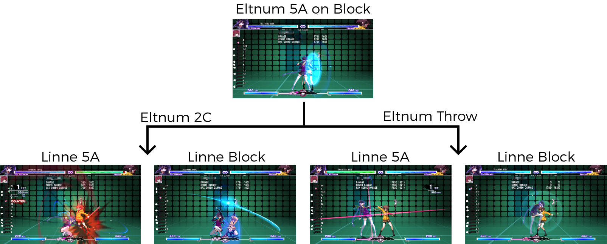

# Preface: A Small Rant on Fighting Game Guides

Many beginner fighting game guides focus on the basics of the basics. They go over all the ways in which to control your character, system mechanics, and any notable normals or specials that are useful. Other guides provide a list of combos you can do with your character off different starters, positioning, and meter. While all of that is useful to a beginner, my problem with these guides is that they often just don't teach you how to play. Fighting game mechanics and character movesets can be really complex and interact in interesting ways. When I'm learning though, all I want is to understand how to get started, not understand every single detail about my character. I find that the majority of guides are like poorly written giant textbooks. They contain everything you would ever want to know **about** the game or the character, but they are incredibly hard to digest and hard to know what is important to pay attention to and what you can ignore for now. As a beginner, you can only learn so many things at a time, and many guides just do not prioritize what information is the most important and how it all fits together when you are actually playing.

For example, That Blasted Salami's  [Julia Chang Guide](https://www.youtube.com/watch?v=W-RWtwZo728) for Tekken 7 is an amazing resource, but it serves more as a reference book rather than a tutorial. I can watch the guide, understand the content, and still have no idea how to even start playing Julia, aside from maybe spamming party crashers.

Because approachable guides are so few and far between, this is my attempt at a small how-to guide on fighting games that teaches you what you need to start charting your own learning journey. The goal here is to teach y'all a framework by which to understand the different situations and decisions during a match, which are at times hard to observe and understand. It is not perfect, and it is no doubt simplified and ignores many of the nuances that can arise. However, it hopefully provides the foundation you need to start learning from your own play and break down the information presented in harder to digest guides.

# Who Is This Guide For?
If you've just finished downloading your first fighting game, this guide is probably not for you. Go play the tutorial, learn about the basics of the basics, and mash some buttons. You do not need to understand everything completely. Hop into a few games and play around! You will learn a lot during matches that reading guides or watching videos will not teach you.

This guide is for you after you've gotten to the point where you know what moves you have, but just don't know when to use them. Maybe every time you try something it seems to be the wrong answer. I was learning Eltnum in Under Night recently and felt very much stuck in the same way. I learned a few combos but I never managed to get the hit to start that combo in the first place. I was watching match videos but none of the mix-ups worked when I tried to apply them in a real match. I felt like I knew **what** my moves were, but I just didn't know **how** to play the game. I didn't understand the different powerful options that she had at different ranges and how they related to each other yet.

<figure>

  <figcaption align="center"><i>At first, I was very confused. Why did Senaru do the overhead here? Why does that never work in my matches? I could not find a single video on how to run offense on Eltnum. Not until I struggled by myself for a long time did I figure some of it out.</i></figcaption>
</figure>

Now that I'm over that hump, I want to write this guide for the past me, and others who might be struggling at that stage of confusion. I believe this might be one of the hardest road bumps one might encounter for someone starting out on any fighting games, whether they are experienced or not. I really think that there really aren't any good resources on how to learn after the basics of the basics. What do you do with the tools that you've learned? What's the point of all of these buttons? How do you open people up? How do you form a basic gameplan? I've managed to get past this stage by scraping together bits and pieces of knowledge after a lot of struggling, but I think that process could have been a lot less painful if I knew what to look for in the first place. So that's what this guide is, an attempt to give you the tools to discover your own gameplan with your own character with a little less pain and meandering than I did.

# Rock Paper Scissors
The lens by which you view something can drastically change how you think about it, and I believe it is the same with fighting games. Fighting games at their simplified core are just rock paper scissors, where you and your opponent both choose an option in real time and the better choice wins. The classic systemic view is the strike, block, and throw interaction, but I find that this view can trap beginners because it is just not true in a real game. Blocking indefinitely will not beat an opponent's strikes, and opponents can still hit you when you try to run up and throw.

Instead, I believe there is another framework by which we can better understand fighting games with better applicability in game. This framework that I want to share is taken largely from one of my favorite existing resources called [GG Fundamentals](https://www.guiltygear.se/gg-fundamentals/). While they originally presented this framework only as a way to understand neutral, I believe this framework is useful in understanding all stages of the game, and is applicable enough to build a gameplan around, so let's get right to it.

In this framework, all options can be categorized into 3 different types: preemptive (oki-waza), reactionary (sashi-kaeshi), and advancing (ate-waze). Similar to the strike, block, and throw interaction, each option wins against another option in a cyclic manner. The difference is that I believe these options are actually applicable in scenarios in game.

1. **Pre-emptive** means striking the opponent before they strike you.
- This is the simplest form of attack. Just hit them!
2. **Reactionary** means waiting for the opponent to make a move first and reacting with your own move.
- This takes advantage of the opponent's commitment to an attack to strike them back.
3. **Advancing** means being momentarily vulnerable, then striking
- This takes advantage of the opponent's inaction to sneak in and perform a powerful attack.

<figure>
   
  <figcaption align="center"><i>Simple example of the the framework based on situations from Footsies (images taking from JWong's stream)</i></figcaption>
</figure>

Generally, pre-emptive actions beat advancing actions, reactionary actions beat pre-emptive actions, and advancing action beats reactionary actions. Note that while I use the term "strike" throughout the description above, they are not limited strictly to normal or special attacks, nor are you always guaranteed a hit. "Winning" an interaction when you're playing defense might mean gaining distance between you and the opponent. On the other hand, losing might mean the opponent is frame positive next to you, letting them apply safe pressure. Scenarios exist on a spectrum, and "winning" or "losing" a scenario just means the match will flow into scenarios that are more or less advantageous.

This framework is one way of bucketing different options and understanding the general interaction between different options. These options will likely be different at different ranges, and a gameplan is simply a collection of these options for these different ranges and advantage states (offense, neutral, and defense). When a gameplan is combined with smart decision making, it pushes the game towards scenarios in your favor. 

So as someone that is trying to figure out how to play, a gameplan is the foundation you need to start making decisions. What you need to do is find out what options are available for your character that fits in each category. And because the ways options get categorized into each bucket depends on the exact range and option available to each player, and there’s a lot of different possible scenarios, it's best to focus on a specific scenario first and work out the different options available there.

While you can find a detailed treatment of how this framework applies to neutral in [GG Fundamentals](https://www.guiltygear.se/gg-fundamentals/), I believe the most important thing for a beginner to learn is how to run basic offense and defense. Neutral in a fighting game is volatile, with many possible ranges and options that can make it hard to initially comprehend. Offense and defense on the other hand are easier to learn because it is often more structured and with limited options on one side. Offense is also extremely important as it is the payoff from your hard work of winning neutral, and a major part of doing the cool thing for your character. So, the rest of the guide will focus on how the framework applies to offensive and defensive situations, how to identify when you’re in a defensive situation and figure out the options you have, and how to build your own first offensive scenario. So, let's get started! 

# Identifying Defensive Situations

When are you in a defensive situation? You might have heard defensive situations described as "the opponent's turn" and that is because it is true! It is their turn to press buttons! Why is it their turn to press buttons? Well, it is about what happens if you both try to press buttons at the same time. I would call a situation a "defensive" situation if the following two criteria are satisfied simultaneously:

1. If both you and the opponent choose a pre-emptive action, you'll generally lose.
    - ex. if you both try to press buttons/mash, you will get hit.
2. The return on the reactionary action is very poor.
    - ex. the only "reactionary" thing you can do is block. Often, blocking will only lead to a slightly better defensive situation.

<figure>
   
  <figcaption align="center"><i>As an example, take a look at Linne's options <b>after</b> blocking Eltnum's 5A in Under Night. If Linne attempts to poke out with 5A, she will be hit by Eltnum's 2C. If she blocks the 2C instead, she is put into another defensive situation.</i></figcaption>
</figure>

The combination of these two factors means that in a defensive situation, there is little to no risk to the opponent pressing a button! Identifying these situations is a crucial first step in playing defense well. It is sometimes not an easy task, as whether you are in a defensive situation depends on positioning, moves used, distance, and other factors. However, there are often consistent tells such as after blocking a specific attack at close range, or you are waking from a knockdown scenario. Another test is to just mash some buttons and pay attention to when you get hit vs when you hit them back! Though if you are trying to mash and are consistently getting hit, it is possible that you are not in a defensive situation but rather just not hitting the right button that is both fast enough and has a long enough reach. 

# Understanding Defensive Options
Now that you've identified a defensive situation, how should you think about which option to use? The key here is to understand that the opponent's pre-emptive action has an extremely low risk to reward ratio. Oftentimes, the reward from your reactionary action (blocking) will lead to additional defensive situations (though this will eventually stop), meaning that the opponent gets multiple chances at opening you up. In defensive situations, one typical opponent behavior is to often use many pre-emptive actions, then mix in advancing options to force you to use pre-emptive options yourself.

<figure>
   
  <figcaption align="center"><i>An example of Eltnum's advancing options after a blocked 5A and it's interaction with Linne's 5A</i></figcaption>
</figure>

I've been speaking in a little abstract in the above paragraph, so let's give a short example of what these options map to for your character. A simple offensive plan by the opponent might be mixing in between performing a normal attack right away (pre-emptive), and run up to throw (advancing). On the defender side, you can either block (reactionary) to beat the normal attack, or mash a quick normal attack (pre-emptive) to beat their run up throw. Note that the pre-emptive option needed to counter the opponent's advancing action might be different based on what they do, but a quick light attack will often do the job, but it could also be jumping back or back dashing. 

Playing defense well is about being able to consistently identify these situations, understand both you and your opponents options, the opponents tendency, and the current game state, to understand which option provides you with the lowest risk to highest reward. Playing defense is HARD. But it is supposed to be hard because it is a naturally disadvantageous situation (in contrast to offense, which is a naturally advantageous one). You'll get blown up sometimes, and that happens to everyone, so give yourself some slack!

Hopefully, this gives you an idea of what it means to play defense and the tools to look for in your character to help you do so. There is a lot more to playing defense, and I haven't covered things like overheads and cross-ups. However, I would say the most important skill to develop is to be able to identify defensive situations and the pre-emptive and advancing actions of the opponent, then figuring out our own pre-emptive actions to beat their advancing actions. If you can do that, you can slowly process whatever comes your way and be on your way to getting better!

One final note is that sometimes the options available might be tricky to spot or understand because they are "option selects". Option selects are actions that can have different results based on the opponent's chosen option, thus covering multiple options at once. Though note that as good as these sound, they are often pre-emptive and thus have their own weaknesses. An example of such a defensive option is "fuzzy mashing", where you mash on a delay after blocking an enemy attack. This lets you both block the immediate attack and beat out any slow advancing attack! However, this fuzzy mashing loses to a delayed follow-up because the defender is often committed to that delayed attack. So keep your eye out and ask questions if you are confused!

# Finding An Offensive Situations
If you understand defense, then offense is just understanding the game from the opponent's point of view. However, I think offensive situations are even more important to figure out than defensive ones because messing up can potentially put yourself from an advantageous situation into a defensive one. You want to be able to take advantage of your own defensive and neutral plays and have it pay off into damage!  

Taking the opposite viewpoint of the defensive situation, the options in an offensive situation contains:
1. A pre-emptive action that will beat out the opponent's pre-emptive actions
    - Usually the quickly attack that will reach at the current range
2. One (or more) advancing actions that can get past a reactive opponent
    - You run up into an attack or throw, or there might be specific slower attacks that your character can do that puts you in an advantageous position (to run more offense).

While this sounds simple on paper, finding an offensive situation and its corresponding options during a match can actually be quite hard. Each character has a lot of moves, and it usually takes a very specific set of moves to set up and run an offensive situation. You need to find a move to set up your offensive situation, and also figure out the corresponding pre-emptive and advancing actions. If you’re just testing things out during a match, the chances that you randomly picked the correct option is small and you’ll get hit as a result. 

<figure>
   
  <figcaption align="center"><i>Eltnum's options after a blocked 5A. The same situation as above, but now from Eltnum's perspective!</i></figcaption>
</figure>

I think these are the things that many tutorials are truly lacking: simple description of these offensive situations and the options you have afterwards. While I can't do that here for you since I don't know what character you play, here's a few pieces of advice I have on finding the offensive situations for your character.

1. Take a look at the frame data for your various moves. If a certain move is positive on block, then it is likely that using the move will put you in an offensive situation especially if it leaves you at close range.
2. Set up the training mode dummy to block always and perform their quickest attack on recovery. Test out various attack strings. The goal is to find an attack string where the first hit sets up an offensive situation, and the second attack is a pre-emptive attack that leaves enough of a gap for the opponent to attack, but not big enough for them to hit you.
3. Watch match videos and try to understand how the opponent got hit especially if they are already blocking. Find another instance of that exact same situation except now your character chooses another option. One thing I do want to say is that if you're following this method, expect to be confused as the best players will have many many offensive situations in their arsenal and vary between each of them to not let the opponent catch on to any patterns.

Once you find an offensive situation, add it to your toolbox and test it out in game! I suggest using the pre-emptive action more often in the beginning until you condition the opponent to block. Once they get comfortable blocking, then go in for the advancing action. But if you have a read on what the opponent will do, then pick the corresponding action that counters it! Slowly over time, you'll add more of these situations to your repertoire and your offense will become stronger over time. 

# Final Words

That is all I want to teach y'all about! When I first learned about this framework from [GG Fundamentals](https://www.guiltygear.se/gg-fundamentals/), it was an eye opening experience to slot the many vague and abstract strategies that I've had playing fighting games into a neat overarching framework. And while that resource only applied the framework to neutral situations, I found it equally applicable to offensive and defensive ones. As a beginner, understanding even a single offensive situation can bring life to your play. It sharpens your focus during neutral and lets you build a gameplan towards getting into offensive situations. At the same time, you will also slowly recognize the options you have in defensive situations against the opponent when you play against them repeatedly! 

I hope this guide gives you the tools to start charting your own learning journey in fighting games. Good luck, and see you under the Hollow Night!