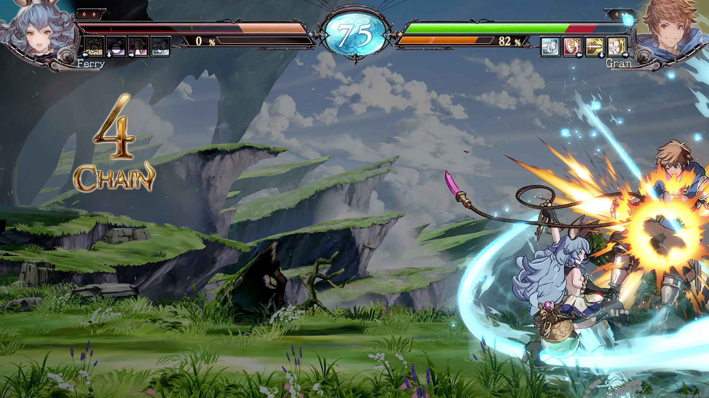
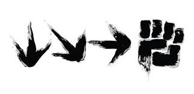
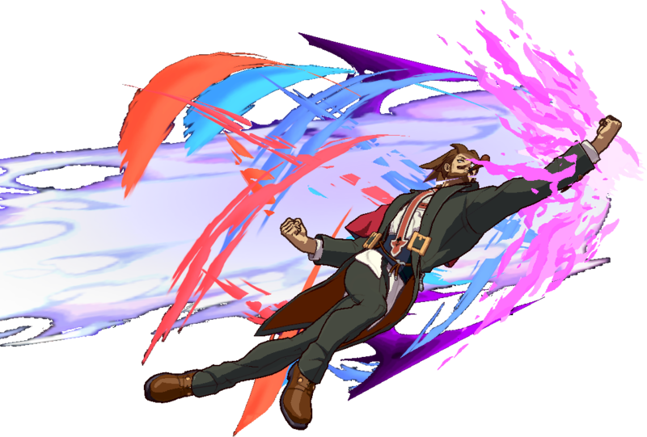
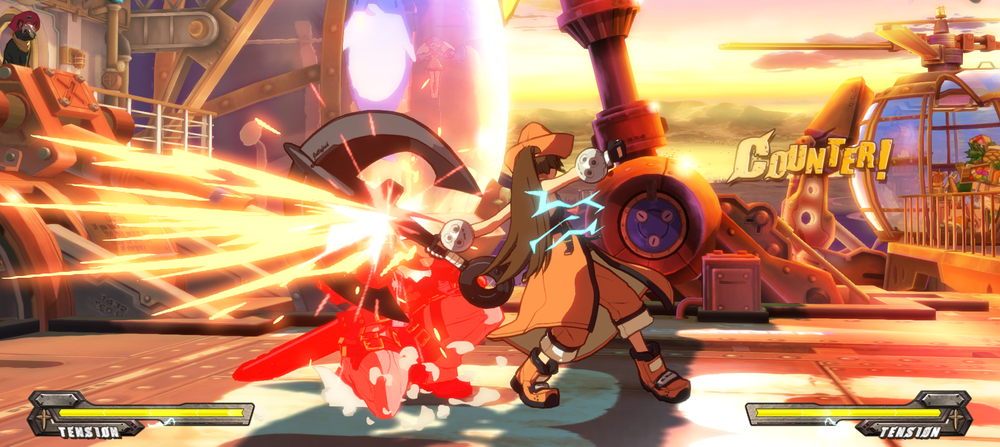
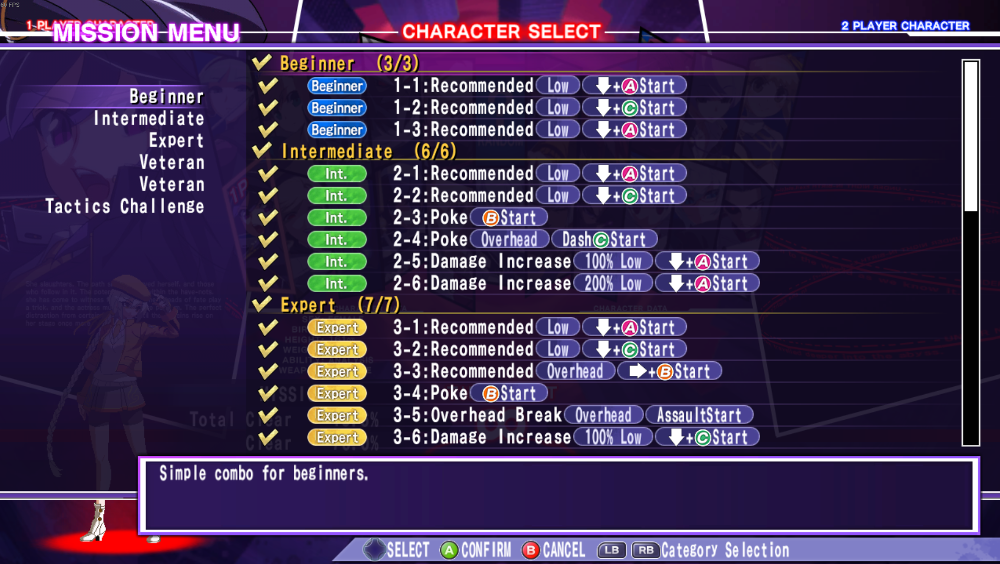
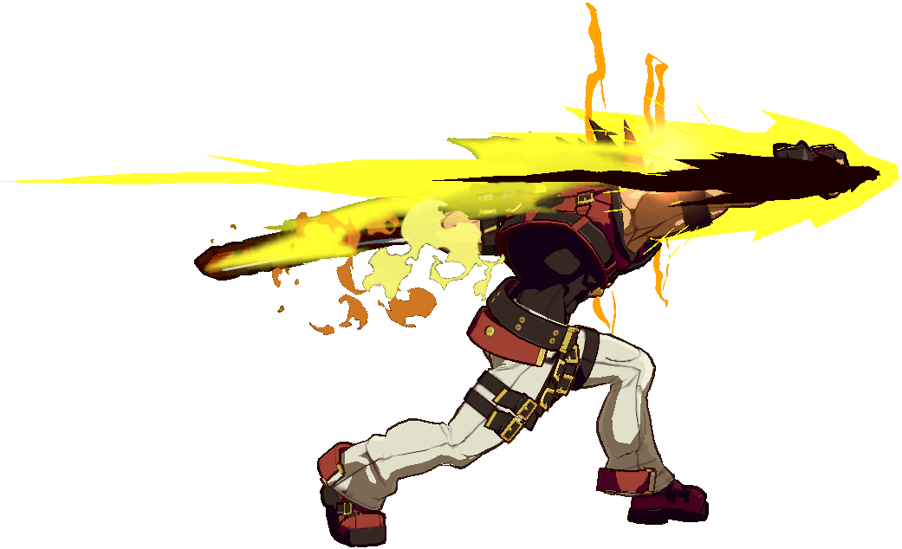

## Preface

So, I had a giant draft about accessibility of fighting games and my observations about the problems with motion inputs for a long time. However, I never really managed to finish it because I didn't have a clear idea about what I wanted to say and it was a little too much of a rant. In an effort to put something out, I've cut it down to the essentials. This piece isn't everything I wanted to say on the topic of accessibility in fighting games, but I think it does a decent job at what I wanted it to do.

## Introduction

One of the reasons why I wanted to write this article in the first place was a worrying trend of simplification among recently released fighting games. Just to list a few, Street Fighter V was released in 2016, Fantasy Strike in 2017, Blazblue Cross Tag Battle, Rising Thunder, and SNK Heroines in 2018, and Granblue Fantasy Versus in 2020. These games simplified execution while lowering the execution skill ceiling at the same time, and as a result disappointed me, my friend, and I'm sure many others too. We love fancy combos, sick conversions off stray hits, and the hype reaction supers that we both do ourselves and see on the big screen. These games oftentimes just do not quite have the same bombastic craziness with execution in one way or another that made other titles so enjoyable to play and watch.

<figure>

  <figcaption align="center"><i>BBCF EVO 2017 Grand Finals. One of the hypest set of Blazblue ever. </i></figcaption>
</figure>

A common sentiment in the FGC is that we want more people to enjoy fighting games, and that motion inputs, like &#8595;&#8600;&#8594;P for fireball, or &#8594; &#8595;&#8600;P for dragon punch, frustrates new players and turns them away. Many games like Rising Thunder and Granblue Fantasy Versus removed motion inputs or made them optional to be more approachable. However, not everyone was happy with the removal of motion inputs. Many community members defended their importance in fighting games. If you're not caught up, you can read this awesome article [Why Motions are Important in Fighting Games](https://atmasarchive.wordpress.com/2017/08/25/why-motions-are-important-in-fighting-games/), and watch these excellent Core-A Gaming videos:  [The Consequences of Reducing the Skill Gap](https://www.youtube.com/watch?v=iSgA_nK_w3A), [Why Motion Inputs Still Exist](https://www.youtube.com/watch?v=2WhbSNP_zF4), and [Analysis: The Simplest Fighting Games](https://www.youtube.com/watch?v=-sUVNqNSo5M).

My problem is that the way these games removed motion inputs and the community discourse around it felt callous. In the process of making accessible games, developers seem to have failed to conserve the high execution skill ceiling that made matches intense to play and watch. In community discussions, there is an underlying belief that complex motion inputs are bad for accessibility, but I have yet to find a discussion on what made motion inputs inaccessible in the first place.

<figure>
  
  <figcaption align="center"><i>Paraphrasing a conversation I had, "I hate it because because I learn 2 combos and I'm done".</i></figcaption>
</figure>

This discussion is my attempt to analyze *why* motion inputs is a frustrating and unintuitive system. Just like many others, I hope fighting games can be more accessible towards newcomers so more people can enjoy this awesome genre. However, many of these "accessible" fighting games are putting a doubt in our minds about whether a beginner friendly fighting game can have exciting execution opportunities. I believe so, and I believe that we can make a fighting game that retains the fun and interesting aspect of motion inputs while making it more player friendly. To do this though, we will need to better understand the success and failings of the current motion input system. Many people before me have already explained why motion inputs are awesome in great detail. Here, I hope to contrast that discussion with a deeper dive into how motion inputs can cause frustration, especially to new players.

## Motion Inputs are Hard
I recently had the opportunity to onboard a friend of mine on how to play Guilty Gear. I'm sure anyone who has tried to teach beginners has racked their brain on how to properly teach someone a fireball motion. I've done the "so you go down, down forward, forward, punch" into the "wait hold on a second, stop jumping around and mashing buttons" many times over. Inevitably, they manage to get everything BUT a fireball, and I would have no clue what to say.

<figure style="text-align:center">
  
  <figcaption align="center"><i>Thanks game, this totally teaches me how to do the move!</i></figcaption>
</figure>

I believe that that motion input is not a player friendly system. There are many aspects of the system that can frustrate any player, especially new players who have yet to learn its intricacies. I see three causes of frustrations with motion inputs. The biggest problem is that motion inputs provide terrible feedback on failure and do not teach players what they did wrong. Second, it is extremely punishing to mess up motion inputs in a real-match situation. And finally, players are forced to master motion inputs before having access to the fun and interesting tools of their character. Let's dive a bit deeper into each of these points.

## So... How Did I Mess Up?
One underappreciated fact is just how many ways you can not get a special move when you try to perform one. Let me try to list the ways in which you can mess up the classic fireball input (&#8595;&#8600;&#8594;P), one of the simplest motion input there is and the building block for many others:

1. You could press punch too late
1. You could press punch too early, when joystick was at diagonal instead of forward
1. You could do the motion too slowly
1. You could start at down-forward instead of down
1. You could not move the joystick all the way forward (missing the forward input)
1. You could skip the diagonal direction when doing the motion
1. You could have been moving forward before, so you got dragon punch instead
1. You could have been moving backwards before, so you got a half circle special instead.

<figure style="text-align:center">
  
  <figcaption align="center"><i>Hadouken!!!</i></figcaption>
</figure>

Now, imagine you're a beginner playing your first fighting game. You have just seen Ryu doing these super cool fireballs, so you go into training mode and try to do &#8595;&#8600;&#8594;P yourself. What do you get? Of course, you get everything but the move you want! Here's what move you might have performed instead:
1. Standing punch
2. Crouching punch
3. Jumping punch
4. Shoryuken!

Given one of the four outcomes, can you figure out what you did wrong? From experience, if you got Shoryuken, then you might have been moving forward before and didn't move your stick back to neutral before doing the motion. If you got crouching punch, you might have pressed punch too early, or forgot to go all the way forward. If you instead got jumping punch, it's likely that you either pressed punch too late, maybe you just missed a direction, or you did the motion too slowly. Either way you should clean up your inputs. If you got a standing punch? Well, I'll have to see your input history first.

Do you see the challenge there? There is really no clear way of correcting yourself given the wrong outcome unless you have access to the input history. In FPSs, if you missed a shot, your aim was off and you can tell how off you were instantly. In League of Legends, if you missed a last hit, you either attacked the minion too early (shown by the minion not dying to your auto-attack), or attacked too late (minion already died by the time the auto-attack reached). In fighting games though, there are so many different ways to mess up doing a fireball and none of the results give you a clear answer on how you messed up. This means that when you mess up a special move during a match, you would have no idea why and no way of correcting it. Of course people get frustrated. I get frustrated, my friend get frustrated, and we have several hundreds of hours in fighting games and get these moves A LOT more consistently than a beginner will.

<figure style="text-align:center">
  
  <figcaption align="center"><i> My friend: YOU SEE THAT 5 CONSECUTIVE JUMP S THAT I DID? THAT WAS ME TRYING TO DO SLAYER’S SUPER</i></figcaption>
</figure>

The way that we've learned to get special moves consistently is go into training mode, turn input history on, and just start grinding out special moves until you can do them 10x in a row on each side. Input history gives you a better picture of exactly what you did wrong by listing the directions and buttons leading up to the point at which the fireball did not come out. I don't think I have to tell you why asking beginners to go into training mode and spend possibly more than an hour practicing before playing is a bad idea. 

## Oh You Guessed Right? COUNTER HIT
Special moves are often powerful moves, whether it is dragon punching out of a wakeup situation, or keeping the opponent out with projectiles. They are also powerful in the sense that they are widely applicable and are often a good answer given the right situation. But when you finally identified the right situation to use your special move in, only to mess up the motion input, you didn't just miss the chance to turn the tide of the match, but you also get punished harshly for the normal that you accidentally used.

While execution failures can add tension and interest in a match between two players, it can also lead to frustrations to the person that accidentally failed to input the special move correctly, especially when it costs them the round or the match. Everyone has experienced getting counter hit on wakeup because they tried to wakeup DP or super. Everyone has experienced missing the anti-air special leading to the opponent getting a jump-in on you. It is frustrating because you read the situation correctly, attempted to perform the correct action, only to lose 50% life because you messed up your input.

<figure style="text-align:center">
  
  <figcaption align="center"><i>Huh??? Where's my wakeup DP? (This has happened to me too many times before)</i></figcaption>
</figure>

Now, I'm not saying that having good inputs under pressure is not part of fighting game mastery, nor is this something unique to fighting games (you can say the same thing about whiffing your shots when you jump someone in an FPS) but I think the frustration when you mess up is undeniable. Imagine you are a beginner attempting to incorporate special moves into your game. You learned that dragon punches can beat out any jump-in attempts and try to do so when the opponent jumps. You get a crouching punch instead, and because of its slow startup, you get hit with a damaging combo. This happens over and over again. Now, you're trying to play neutral, inching forward and gaining space, you try to throw a fireball to stop the opponent from running towards you. You instead get a standing punch and get whiff punished instead. For an experienced player, this might happen only occasionally. But for a beginner, it is something that can happen constantly. 

Add on the fact that when you mess up a special move input, you probably don't know how you messed you either because there's no clear feedback. You know what you have to do, you reacted correctly to the opponent, but your hand just isn't doing the special move for some unknown reason. Not knowing how you messed up means you have no way of fixing it especially during an intense match. You can keep trying, but you will get blown up for it every time. How much fun does that situation sound?

## You Aren't Playing The Game Till You Learn
Execution gating isn't something new in fighting games. Oftentimes, there is an easier option to do what you want to do. You can use a less damaging but easier to execute combo, or use a normal rather than a dragon punch to anti-air. If you can't do the 1-frame link consistently, you can do the 3-frame one. So why can't beginners just play without special moves?

<figure style="text-align:center">
  
  <figcaption align="center"><i>One of the reason why Under Night's tutorial is so awesome is because it teaches you combos at different levels of difficulty </i></figcaption>
</figure>

The problem is that developers have been attaching awesome character defining moves to these motions ever since the appearance of motion inputs. Ryu with his fireball and dragon punch; May with her dolphins and beach balls; Rachel with George the 13th and Lobelias. These tools are a big part of what draws players to these characters. They are the moves that allow Faust to throw random items onto the screen and cause chaos. They are the moves that allow Sol to punch the opponent with his flaming fists for massive damage and command grab them when they start being scared.

<figure style="text-align:center">
  
  <figcaption align="center"><i>Why I play Sol</i></figcaption>
</figure>

It is not that beginners cannot play without special moves, and they very well could, but they would often not be able to access the awesome and unique moves that motivated them to pick that character in the first place. Why would you play Ryu if you could not throw fireballs?

## Conclusion
I have witnessed time and time again the frustration with motion inputs when introducing my friends to fighting games. Heck, even I get frustrated myself when I keep missing my DP or super inputs. It is frustrating to have the most powerful and the coolest looking moves hiding behind an ambiguous execution barrier. It can be demotivating to mess up a motion input and have your life bar disappear because of it. And no beginner will willingly sit in training mode for possibly hours just to get to the fun and interesting part of their character.

Yes, you can overcome all these problems I mentioned if you just "git gud", but the frustrations that players feel because of motion inputs is nevertheless real. It is undeniable that motion inputs bring a lot to fighting games, and coming up with a system that maintains the benefits and the exciting execution of motion inputs while addressing its accessibility issues will be difficult. But I believe that it should be possible, and the first step is establishing a nuanced understanding of both the benefits and issues of this system. To me, it seems that motion inputs haven't really been iterated on to address these fundamental clarity and frustration issues that I mentioned, and I think we can do better than straight up ripping out motion inputs from our games. Maybe there is a massive graveyard of fighting games that tried all sorts of alternatives without success. If so, I would love to take a look to see what we can learn from them. But as with everyone else, I just want more people to enjoy this awesome genre that I love so much without losing the spark that made it so great in the first place.