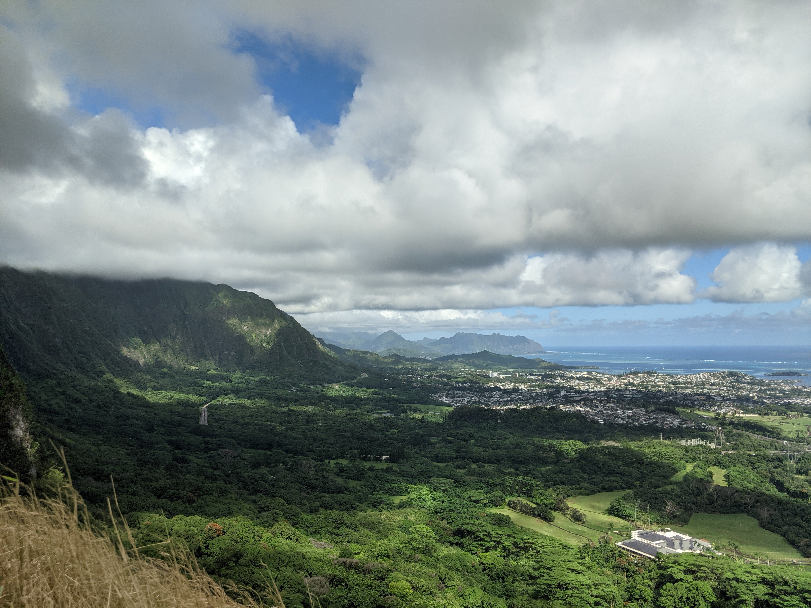
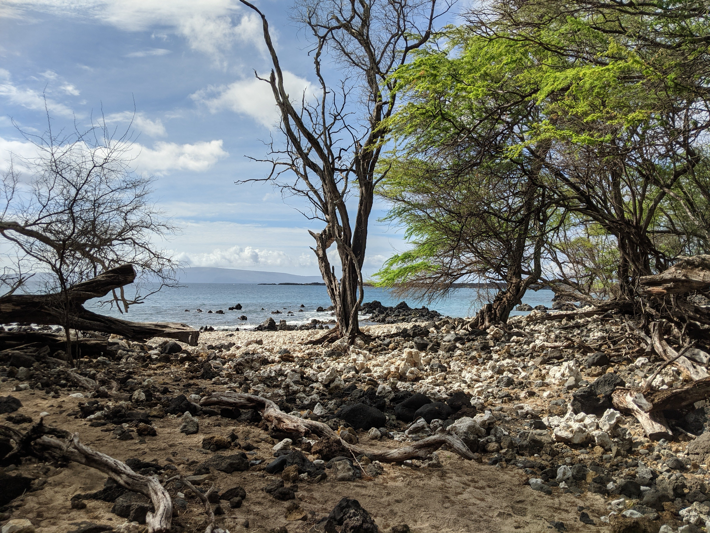
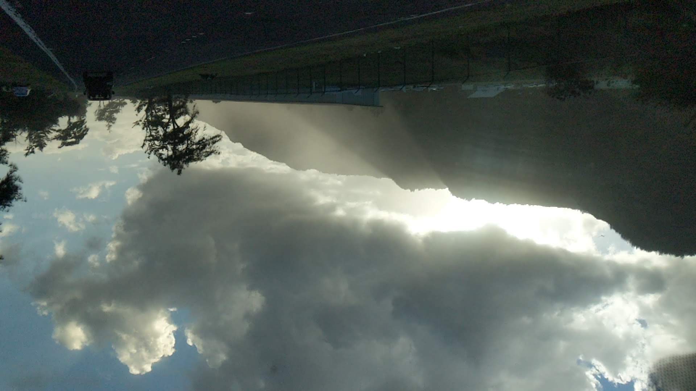
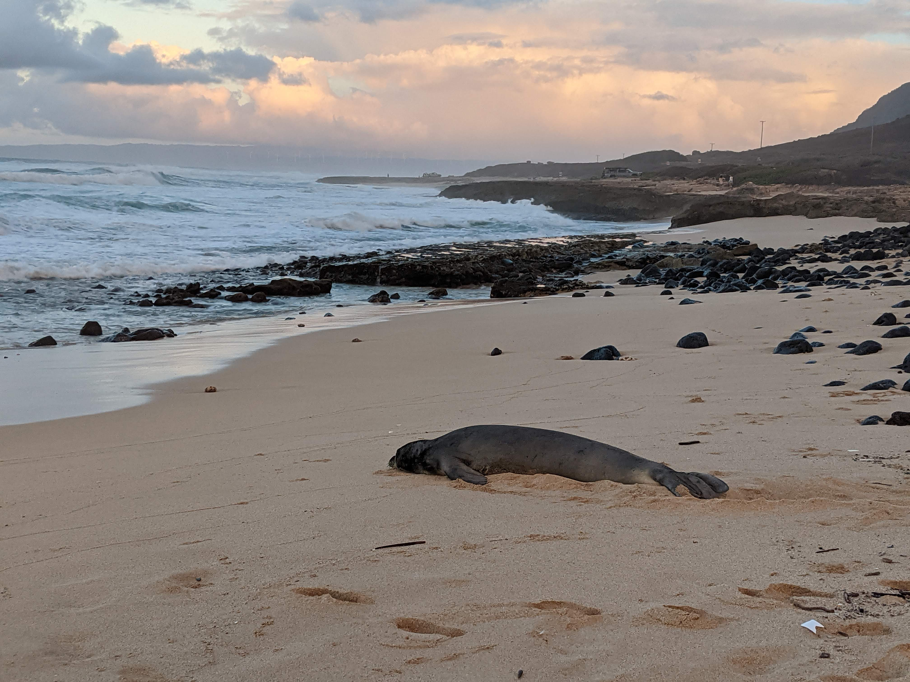

I was visiting my relatives in Hawai'i in O'ahu and Maui so I got around a week of time to explore both of these islands. Just wanted to put down here some thoughts that I had during my time there.

I think visiting Hawaii is really an experience that shows you the breathtaking force of nature. It's big crashing waves, diverse and lush forests, the fine white beaches, and massive mountains and volcanos are all crammed if not within the same scenery, a maximum of an hour or so drive away from each other. 

When you are there, you feel small, insignificant, but yet in awed by the world and what you are seeing before your eyes. It is kind of a cliche, but being there feels like you are somehow in the middle of a painting or movie. It is so picturesque that it just feels so unreal. It is truly something that no matter how many pictures I show, you have to experience yourself to really "feel" it.

Below are kind of just two thoughts that was swirling around in my head when I was experiencing Hawai'i. They get a little philosophical, but I hope you find them as fun as I did.

## What is so special about life?
The idea of natural selection, of a population being selected and slowly mutating to perform better in the environment, has strong relationship to evolutionary computation and algorithms, where the latter takes the idea of evolution, of a population mutating and being selected over time, to find the solution of an optimization problem. Reflecting the ideas of evolutionary algorithms back upon the evolutionary mechanisms that inspired it, evolutionary algorithms almost seems to say that there is a goal to the process of natural selection, an objective function so to say in the form of evolutionary fitness. The assumption is that evolution optimizes that objective, and that this objective is somehow meaningful.

I think being in Hawai'i, within the vast grounds of nature, and learning about the history of the island really makes me feel that thinking of having any meaning in this evolutionary fitness is really naive. What is evolutionary fitness anyways? Is it the size of your species population? If so is overpopulation and then dying out a "fit" species? If not then is it the amount of time that species has been on Earth? But how would we even measure time? How do we concretely measure existence, if the molecules within even our own bodies are constantly changing? 

The Hawaiian islands have morphed and changed drastically over millions of years. Some plants and animals on the island have went extinct many thousands of years ago, and many more have taken its place. The island, the ocean, and the organisms that lives on it are constantly changing, evolving, and shifting to a different world than the one we've known before.

So if everything is constantly changing then, what makes some "invasive species" that we should control and others species that are "endemic to the island" worth protecting? Why do we assign morality to the world that exists currently, pointing out some as "bad" and some as "good" in ways that isn't directly related to ourselves? Why do we assign meaning to a dynamical system that will continue to evolve far beyond our imaginations and lifetimes? To the best we know, there is nothing truly "special" about life on this planet at all, it's just a sea of molecules swirling around that happened to arrive at this arrangement that we know, just like everything else.

## What's the point of traveling?

The idea that you will not be able to precisely re-experience the past is something that I have long struggled with, and on this trip, came back to the surface again.

Hawaii is a place that I've visited 4 other times in the past. Albeit those times were over more than 10 years ago, I think it is still an equally scary thing that one can have such little recollection of an event they experienced. I can't tell you really what we did on those trips long ago maybe aside from specific broad or small details. I was able to recognize some places that I have been to before, but all the smaller details aside from the most dominant ones are all but impossible to remember. 

As with many things, there's a record of the past. Of the places we went to and the people that were there through photos, videos, and other kinds of records. But many years later, even seeing these records can feel as if you are simply looking at somebody else. Of course there are always faint memories, but it would be a far cry to say I can remember specifically what my experience on O'ahu was like 10 years ago. How can experiences that felt so vivid and important then, be completely gone from memory? Worse, will all the special moments that I experience on this trip also be forgotten through time? What important moments have I forgotten in the past alongside this? To experience something, and to know that what you have just experienced now will someday be completely erased from your memory, I think that is what scares me. What is the point of experience then if it carries no matter to the future? If all you're going to do is forget anyways, why experience?

I think that's why I have these bouts of time where I take videos and pictures of my experience almost religiously. I want to remember. I don't want to lose the experience that I have gained. It is this paranoia of forgetting my experiences that compels me to take this record, as if somehow, taking these pictures will let me hold on to these memories and experiences of the past and bring them with me to the future. 

I think that is all an illusion though. All these records that we chose to capture, to put a glimpse into the past, those are also imperfect. You can never truly capture the experience that you have had, and you can never really relive that experience again. Time passes, new memory forms, and old ones becomes faded and often discarded. No matter how magical I feel at that moment, no matter how brilliant the sun seemed, and how majestic the wave looked at that moment, we can never quite remember and relive that exact moment. And when time has passed long enough, even staring upon these captured images and videos of the past will not bring up the same feelings in you as the moment you have experience it. 

<figure>
  
  <figcaption align="center"><i>Pictures from my family trip to O'ahu in 2003 and 2011. Do I remember eating that plate of shrimps, or visiting Diamond Head during those trips? Nope.</i></figcaption>
</figure>

So if that's the case, why experience at all? I don't think I have an answer to that quite yet. To make peace with this fear will likely require discarding this notion of that the you can even remember anything in the first place. If you give that up, then is there a point to traveling at all in the first place? What's the goal? To see the world that you'll eventually forget anyways? To try to bypass this impermanence and create unforgettable memories? One experiences life, experiences time, but what makes any of this meaningful? 

Maybe one possible answer is that the meaning comes from that moment of experience. The present that you feel that will forever be unique to you and to time itself. You won't remember that moment, but you will have experienced it regardless. Maybe the value in traveling is simply that experience. Not the memories that you will create and remember in the future, but simply to be able to experience it, at the present, and to have experienced it at some point in the past. It's not to say that you have done something, but simply to do it. To give up this idea that the value of something is of the results of it that carry into the future, but that there is value in simply the act of performing, even if there are no memories or record of it ever happening. I think to be okay with that, to be okay with how the moments of one's life will simply fade into the past, forever forgotten, and to be okay your life, your experiences, and all others experiences, will simply disappear into the past without a trace, without the ability to recreate and capture that experience for the future, and to find meaning in the time you spend that will forever disappear, it is something that I think still needs further thinking to grasp.

But really, that might be the only way forward I imagine. To accept the impermanence of experience. To accept and make peace with the fact that no matter how much you try to capture the experience of the past, experience and feelings will only happen in the present. In one sense, you are free. Free of your past experiences, as the memory of your experience washes out like everything else you do, like the memories that I made 10 years ago.

 The impossibility of truly capturing experience is something that I have explored a little bit in a past in this [blog post](https://chunloklo.github.io/schrodingers-cube/true-empathy/). There, I explore the idea around communicating experience, but here, I explore this from a slightly different angle, of the impossibility to even perfectly remember your own experience of the past. The resulting impermanence of experience is something that I have really tried to grapple with and understand since my undergrad days. My ability to make peace with that fact ebs and flows, with my paranoia heightening when I believe what I'm experiencing to be unique, magical, and important in some way, and waning when I'm performing mundane tasks. It is still something I am actively thinking about, and I hope to be able to make peace with at some point in my life.

## Okay I'm done!
Thanks for reading! It definitely got quite philosophical towards the end, but both of these ideas are things that I have had some thoughts from before already, but my experience at Hawai'i really bought those feelings to the forefront.

<!-- I distinctively remember a moment stuck in traffic on the way to work in Atlanta 2017 that I was like ", that I somehow then understood how feel bound by our duty and societal structure, but is ultimately free to choose how we want to live in a world that contains no inherent meaning, that the world is merely just a mass of particle swirling around anyways. -->

My visit to Hawai'i have really been amazing. You don't have to do any of the philosophizing that I do to enjoy the fantastic natural scenery and just being in these magical spaces, but I hope you enjoyed this little bit of it!

