This is an edited version of my unfiltered thoughts after I left my Riot internship during the summer of 2019.

## A little bit about where I came from

Working on games was my dream when I chose to study computer science. I was super interested in art when I was in highschool, churning out pieces with other eccentric individuals in AP art late into the night. I even applied to an art school for game art. I decided that making art for others was probably not going to be my thing and chose instead to do computer science. I know I love art, and I know that love will always bring me back somehow, even without the formalism of schooling. Anyways, the core of it was that games have always been a big part of my life. I've spent hundreds of hours if not thousands playing my favorite games: Battlefield, Starcraft, League of Legends, Street Fighter, and many more. I've met many awesome people through games and helped me connect with others despite distances. I've laughed, celebrated, and cried about what happened within these games.

<figure>
  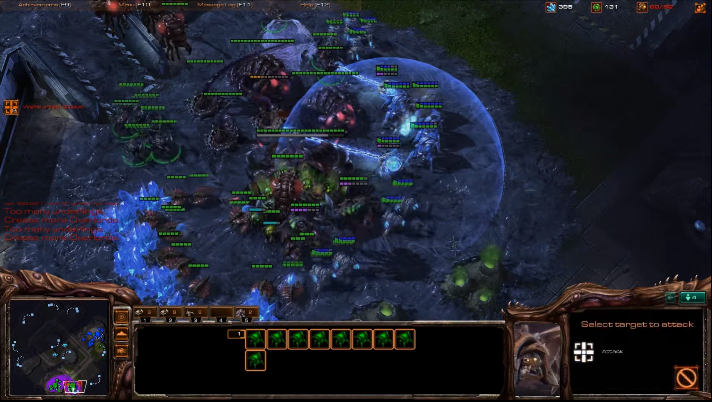
  <figcaption align="center"><i>Ah, yes. The amount of tears I've had over this wretched Protoss 4 Gate </i></figcaption>
</figure>

Studying computer science at Georgia Tech was quite eye opening for me. Knowing little beforehand, I found computer science to be a field that I loved. Computer systems, algorithms, graphics, animations, machine learning, and more, I found every topic to be fascinating. I immersed myself  in my classes, learning as much as I can. I joined various CS clubs and research projects. I'm the guy that will sit in on lectures for classes he's not even enrolled in to learn more when he has the time. Slowly, games became less important to me. I didn’t have time for games when I was going to clubs, working on research projects, and implementing homework problem sets. There was a treasure trove of interesting topics and I was curious about what else is there in CS to learn.

## Going in

Riot appealed to me for several reasons. I was introduced by my friend League of Legends back in middle school and have been playing since the end of season 1 (Judgement Kayle anyone else?). The other thing was, their [values](https://www.riotgames.com/en/who-we-are/values) really resonated with me as a competitive gamer. I'll always remember the Day[9] phrase that went along the lines of "It's actually quite unproductive to win. Losing, instead, points you clearly towards the direction that you need to improve at'', and "Focus on what you need to improve, but don't forget to celebrate your wins!". It is that exact pragmatic ambition that makes me want to see what it's like there. Most of all though, it really was THE gaming company that I could potentially work for before heading off to bigger tech companies. The opportunity cost for joining indie studios was too high, and many of them don’t have the resources to take on interns for a few months in the summer. Aside from Riot, it will be hard to justify not going to big tech companies with better pay, more job stability, and better brand name recognition when compared to less well known and established game studios.

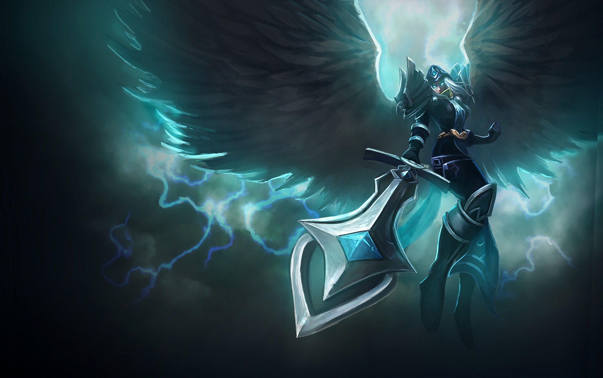

For context, I applied to Riot the first time during my sophomore year but was rejected because I was unprepared for the behavioral interview. I had no clue what kind of questions they would ask and they totally caught me off guard. After they told me that I was rejected, I was surprised that they mentioned that they can set up another call to receive feedback directly from the interviewer. When many other tech companies never even give a rejection email, of course I have to set up this call. The interviewer went through his notes during the interview and told me what his impression of me was and why it was so, and why I didn’t pass the interview. In the end, that session gave me insights into how I was presenting myself to others, and I came up with ways to better tell a cohesive and powerful story about my work history that was also helpful in other interviews.

After that feedback session, I knew I had to give it another try. This time, I have more experience and will be more prepared. I figured out the experiences I wanted to highlight based on what they will show about me. I know I'm notoriously bad at storytelling, prone to going in aimless loops that end up nowhere. So I memorized the key points and practiced it over and over again. I remember the weeks before when I was practicing for the Riot interviews, honing down the exact details that I wanted to tell, and making sure that I highlighted all the important points when I told my stories. This time, I got past the phone screening, the two on-campus interviews, and 5 more grueling rounds of remote "onsite" interviews.

I was ecstatic when I finally got my offer, not only because it was a long journey to get there compared to other tech companies, not only because I practiced my butt off, but it represented a chance to explore a childhood dream that I had left behind. I came into computer science looking to make games, but I found much more that I liked. I never really revisited those dreams of being a game developer. The prospect of a run of the mill software developer is just too good, and I am finding there to be plenty of interesting work at these companies. What reasons did I have to find a job that has longer hours and lower pay? In the previous years, I also applied to EA, Activision, and Ubisoft for internships, but did not hear back. Riot's offer was my chance to experience the game industry before I really hop off to some big tech company for the rest of my life. It was a chance to see the life that the highschool me wanted before I ventured off to explore computer science.

## Expectation

I really didn't know what to expect going in. After the initial rush of excitement died down, I doubted my choices. Many of my friends didn't share much of the same excitement as I did initially. Many people haven't even heard about Riot or are interested in working there. Meanwhile, my friends were "climbing to the upper echelons" of internships at big tech companies like Google, Facebook, or Amazon. It felt like a guilty pleasure, exploring a dream that felt perhaps a little childish compared to my friends. Gaming companies are famous for long hours and low pay, and with the [Kotaku article](https://kotaku.com/inside-the-culture-of-sexism-at-riot-games-1828165483) that described a culture of sexism within Riot, I became even more hesitant. Am I setting myself up for a summer of hardship in a toxic environment? How valuable will this experience be to my long term career? Even as I doubted though, I felt that I had to see it for myself.

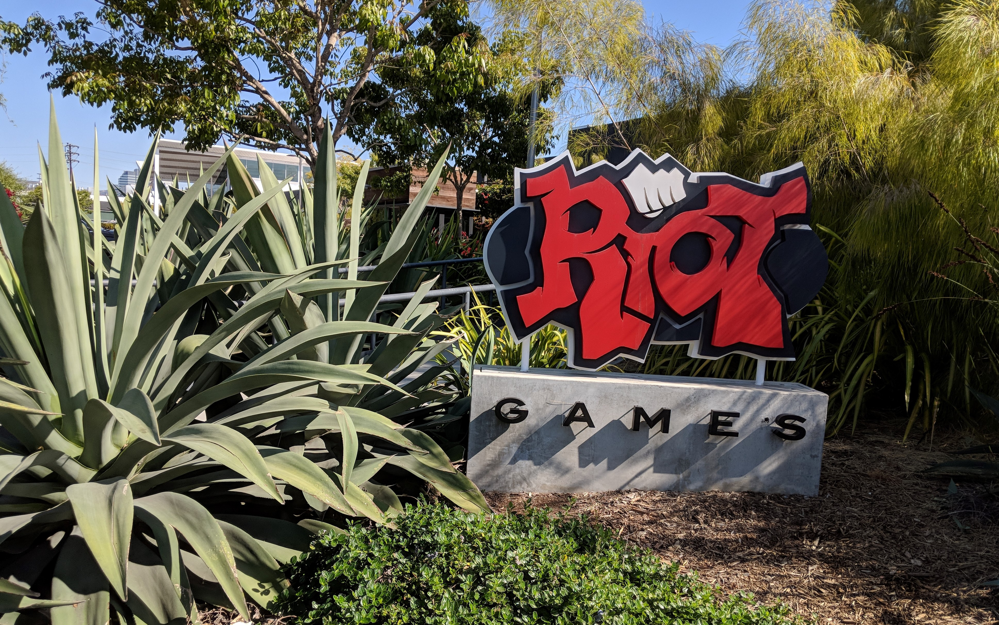

## Impression
This is going to sound like a pretty drastic reversal, but my few months at Riot took away all of my previous reservations.
My impression of Riot was pretty well summarized by these jumbled few lines that I wrote on the flight from LA after the internship:
>"What a place is this man. Thanks for bringing together all these awesome people at this place. This is not anything I would have expected. I guess I didn't know what to expect. This place is filled with people that care about players, care about each other, and are passionate about the stuff that they are building. They aren't afraid to speak up, to challenge each other, and to exchange ideas to find ways to continue to improve."

What really impressed me the most was about Riot was just the sheer level of care people had at the company. They care about the people that play their games, they care about the work that they are doing, but most of all, they care about each other. Whether I was playing games with others or asking them work related questions, everyone I've talked to has just surprised me with how nice, receptive, and understanding they are. We work as a team, we take ownership of our decisions and our code, and are open to feedback and quick to help someone in need. This extends beyond just my team. There is this meme about being aligned but people really are responsive, reply, get on calls, and just really care about getting on the same page and resolving issues. Someone went out of their way to address some problems with me and a coworker's code, another quickly wrote tests to unblock us. A person that I initially found cold and hostile turns out to be so nice and friendly and ended up letting me talk directly with the Wild Rift team to resolve communication issues. Like when my teammate fixed a testing bug for passing error codes through http calls that I noticed earlier, and like what my manager did when he put a show logs button so it's easier to send logs to us for debugging, it's clear that people care about the things that they built. Our product was far from perfect, but it's goddamn awesome that people just care so much. It was awesome that I got to chat and get in touch with so many teams, and while I won't say there isn't any drama, you can tell everyone is trying to be on top of things. People move around to different teams, transfer different responsibilities, but finding the people you need is never a few questions away.

<figure>
  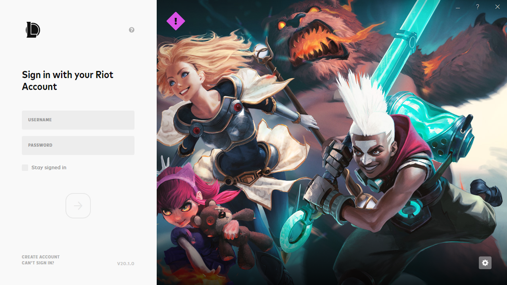
  <figcaption align="center"><i>I was part of the "Foundations" team for Riot Client</i></figcaption>
</figure>

Maybe I got the intern treatment, but you really get the sense that people care about you and your work when you are there. I remember hearing from executives about gauging burnout or stress level, teams trying to improve that for everyone on the team, and celebrating that when it's good. A teammate and I were trying to get something into hotfix before the next release and had a passing thought that we might want to work weekends to make sure the other people aren't blocked. Hearing that, an engineer from the Client team who we were working with immediately came by and chatted with us, telling us that no one should be pressuring us to work weekends and no one should be feeling like they have to work weekends. He told us that from personal experience that it is really easy to start burning out from experience, and that you need to make sure to take care of ourselves.

From working with him, he initially came off as harsh and we were both feeling the pressure. We were helping out with the Client team and so both of us were working in an unfamiliar code base and the problems seemed harder and harder as we kept taking more things into consideration. We joined calls and chatted in person on and on about details big and small, from code reviews to design comments, and in the end didn't by the end of the week deadline that we set for ourselves. In the end though, it feels like I met someone who really cares. He is very well technically versed and thinks about many more long term consequences than we do. He cares about the quality of the code we are pushing out, cares about the future and extensibility of what we are doing and doing the best thing possible given our current knowledge. Most importantly though, he also really cares about the people he's working with.

He ended up taking a day off for mental happiness and stress and I just wanted to support him.  He's not even on my team.

## 1:1s
Riot has a huge culture of 1:1s. There's a rumor that you can probably grab a 1:1 with Mark Merrill if you really wanted to. You have 1:1 with your manager, your mentor, and your team manager. I had a 1:1 with our new dev manager when she joined our team. I think these 1:1s lets you develop a better personal connection with people on your team and within the company. Working together is much easier and more fun when you actually know the people you are working with. What this also means is that it's a good excuse to talk to everyone that you ever wanted to talk to! I got to talk to engineers that I admired. I was curious about gameplay engineering, so I got 1:1s with many awesome individuals from the Champions team and the Game Modes team. It was awesome listening to their stories, where they've been and where they want to go. Chatting with everyone, it's clear that they are interested and care about what they do. It might not be where they will end up, where they want to be necessarily, but they care about games, care about the value of their work, and that's goddamn awesome. A tech artist I talked to really wants to improve the lives of designers and develop tools for them. When I mentioned script reviews to her, I remember her being really excited. Of course engineers would all be on board to improve the quality of their code. It was insightful when she responded with reasons why designers might be hesitant to implement such a system as it might unnecessarily slow down their design process. I guess it's just that level of caring, drilling down and understanding what the problem is, that really gets me excited. Everyone is just excited to learn from others and make something awesome.

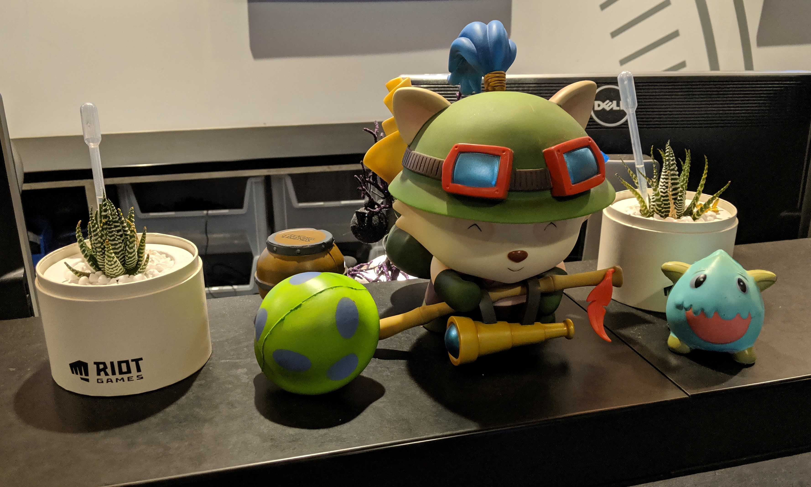

I was nervous early on to get my first 1:1 with people that I didn't know well. But as my time was coming to an end, I was like damn it, I need to make the best use of my time. I chatted with a teammate who was joining an R&D team, then someone else who I worked with and admired because they are honestly a super OP engineer, and then off to more people. If you go in with things you want to talk about, give a little bit about where you come from, where you want to go, and how they fit into the picture, you can end up having some really insightful conversations about your career, or anything you are passionate about. It definitely helped me get more perspectives on how to get where I might want to be in the future and what that future actually looks like. Regardless though, it was just damn awesome learning more about these people, finding out where they come from, what they are passionate about, and how they are going about to do the things they want to do. I ended up having such an enjoyable time that I remember basically having at least one 1:1 with people everyday for the last few weeks, up until the last day of work.

Tips to anyone joining Riot for internships or full time, I told myself that I would brave up and ask people to have 1:1s early in the summer. I didn't end up braving the waters until a teammate was about to leave our team. I know it's hard to put yourself out there, but do it anyways. Think about what you want to do in the future and talk to people that can guide you there. The trick for me is to always be prepped with questions and topics you want to ask beforehand. Who knows where the conversation might go, but it's good to have that in your back pocket if you suddenly don't know what else to talk about.

Thank you to everyone that has lent me their time. It was an amazing opportunity to learn from y'all and hear your stories. Each one of you inspires me to keep finding my passion and pursue it relentlessly.

## Games
It is undeniable that games are a big part of Riot’s culture. For those who wondered, yes I played a lot of games at Riot. I played more games than I ever did during my 3 years of college combined at Riot. Our team had weekly game sessions where we all get together and have some fun with all sorts of games, whether it is digital or analog. It's a place where you walk by and see people just casually playing games to take a break from their work, getting hit up for post lunch games on Slack, and chat after work over a Rift game. Playing games served as my way of connecting with my team. You'd be working with them, but also playing with them.

<figure>
  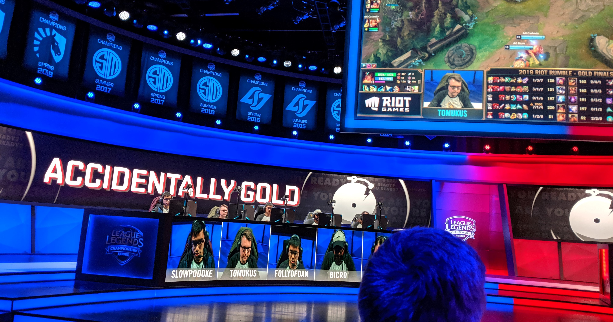
  <figcaption align="center"><i>One of my teammate DEMOLISHING with his AG top lane skills</i></figcaption>
</figure>

What is really more important though, is that people at Riot values what games can bring to people. Before this summer, it feels like I slowly forgot how important games were to me. The joy that they bring, the communities that they create. How the fact of playing together can connect people, can enable people to interact with our world in a fantastically different way. In MMOs, there's the whole gambit of society. I listened to stories of our Product Lead stealing and scamming others in Everquest. We talked about the games that we are hyped about or are playing over lunch. I played intense matches of Street Fighter with my teammate from Poland when he visited. I shared my hype for Project L with other fighting game fanatics and played games to destress after work. In the end, it’s not about being diamond in League, and you don’t even have to play a lot of games to fit in right at Riot. What is crucial instead is an understanding of how games and play can bring immense value to people’s lives.

<figure>
  
  <figcaption align="center"><i>Me chilling with some TFT at my desk</i></figcaption>
</figure>

For me, I never felt more at home in the culture at Riot. It feels like everyone is there for a reason. People are passionate about the work that they do, the people that they work with, and the games that they play. It feels like the best part of gamer culture. People I've met are ambitious, hard working, genuinely care about the work that they do, but also caring and not too serious and down to have fun. I love how nerdy my team was, and it made me feel right at home.

### Kotaku Article
I don’t think this would be complete without addressing the [Kotaku article](https://kotaku.com/inside-the-culture-of-sexism-at-riot-games-1828165483) and how I saw it impacting Riot. However, I feel rather incompetent in addressing it in detail given my lack of engagement in activism. I do care about this issue though. I care for my fellow female colleagues, and everyone that I work with. Also, I’m a firm believer that toxic environments, no matter who it might be targeted towards, affect all those involved. What I have to say is that people are talking about it. We had sessions in our denewb that directly addressed this issue, we talked about it amongst our intern groups, there are Q&As where people get to question Riot’s plan to move forward. I think the most important part is that people are talking. I don’t know whether the steps they are taking are good or bad, but I think this dialogue is healthy and useful for the company. Personally, I have not experienced, witnessed, or heard of any harassment during my time there. Everyone that I interacted with were wonderful people in accepting of each other’s differences.

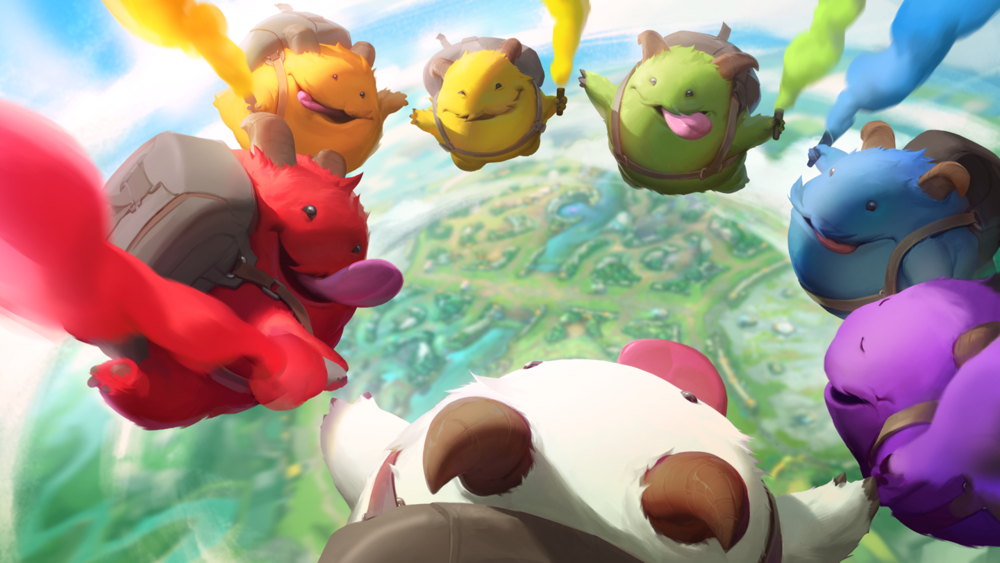

## Ten Year
I’m super honored to have been there when TFT launched into blaring success.  It was exciting to be there when Riot finally released its second game. We got to have a sneak peak to the 10 year announcements before it went live to y’all and I’m sure every single intern’s jaw dropped as they showed us everything they have been hiding all these years. Legends of Runeterra, Wild Rift, Arcane, Valorant, TFT, everything was so hype. It was amazing to be part of something that just makes people so hyped up. It was awesome to see all the amazing art and design going into them, and to know that you are part of making that happen, that’s something else.

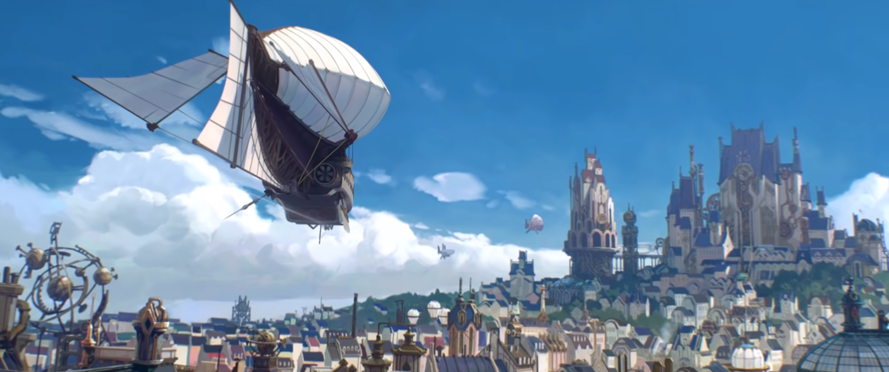

## Intern Class
Okay, the interns of this class are goddamn awesome. Everyone is unique in their situation, their interests, and definitely knows what they are doing. You can tell everyone is here on a dream, excited to have a peek inside to see what it's like inside Riot. What’s surprising was how uniquely interesting each person was. One plays tons of league, others fangirl over e-sport celebrities, all the art interns are amazing at their jobs, and there was an engineering intern that just does these awesome graphic novels on the side. Just like everyone else I’ve talked to at Riot, it felt like everyone was here for a reason. They are ambitious to chase their own dreams, ready to push for the next steps of their life. They are thoughtful, interested, and driven to be their best and work towards that. They aren't afraid to talk about workplace issues that came out during the Kotaku article. It's not exactly one big happy group, as there were more than 40 people,  but I'd say everyone carved out their own happy place, and we are friendly even to those outside our own space. There was this sense that everyone connected with someone one way or another. I shared my game making and research ambitions with other interns. You'd be working with them, but also playing with them. And it's both of those memories that makes it really feel special. There so many fun memories of going out to the beach, getting food, playing games (remember that awesome ARAM comeback that I fell out of my chair for in the Challenger room?), hanging out and watching movies, and getting excited and hyped over the unreleased games that's all going to happen.

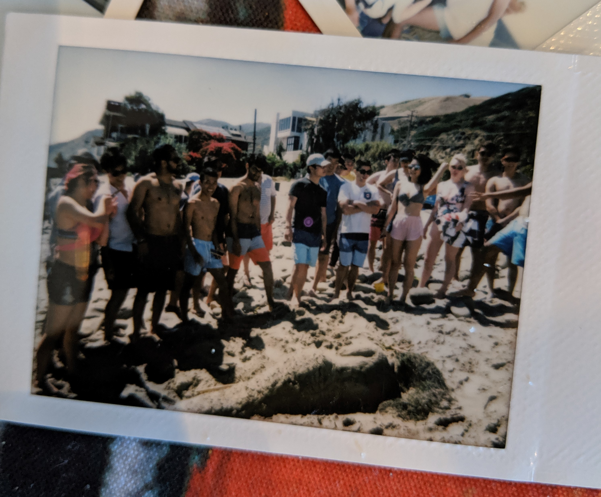

# Work
I am pretty confident to say that I’ve learned more at Riot about work than I have at any other internships. While my team assigned me a somewhat vague project of developing integration tests for Riot Client in the beginning, I ended up just being part of the team, picking up tasks that needed to be done based on our priorities. There were so many things that I learned just by being part of the team, whether it was keeping up with all questions and bugs coming in, or participating in roadmap meetings to see where we want to go. There were also amazing people on my team that asked so many great questions about the things that I did. What’s the problem you are actually trying to solve? Why is your code structured this way? All of my teammates amazed me with their attentiveness to details and desire to solve the problems. I’m definitely still working on it, but these amazing individuals forced me to think and grow beyond a person that simply does tasks that he gets told to do, to go from a person that pulls down and does Jira tickets to one that actually solves problems for the team. While I was slightly disappointed at first since I wanted to be on a game team, I'm super grateful for this experience that has let me grow as an engineer. Without a specified “intern project”, I learned the importance of being in sync with my team’s milestones, keeping up with the influx of questions and bugs we were receiving, and balancing a tight time budget with our need to learn and grow. I worked on features, build systems, testing, telemetry, and even chatted with multiple game teams like LoR about integrating our services into their games. No I didn’t have a giant shiny system to talk about in the end to show off to others, but I learned more about how to work in a team and be an effective engineer than I would have had otherwise. How to ask for help, how to support others, and how to build connections with others. These are all invaluable skills in actual work that will probably be harder to develop in a siloed “intern project”. What’s more important for me though, in this last internship before actually going out to work, is that I feel like I actually got to see what it is like working on a team.

<!-- 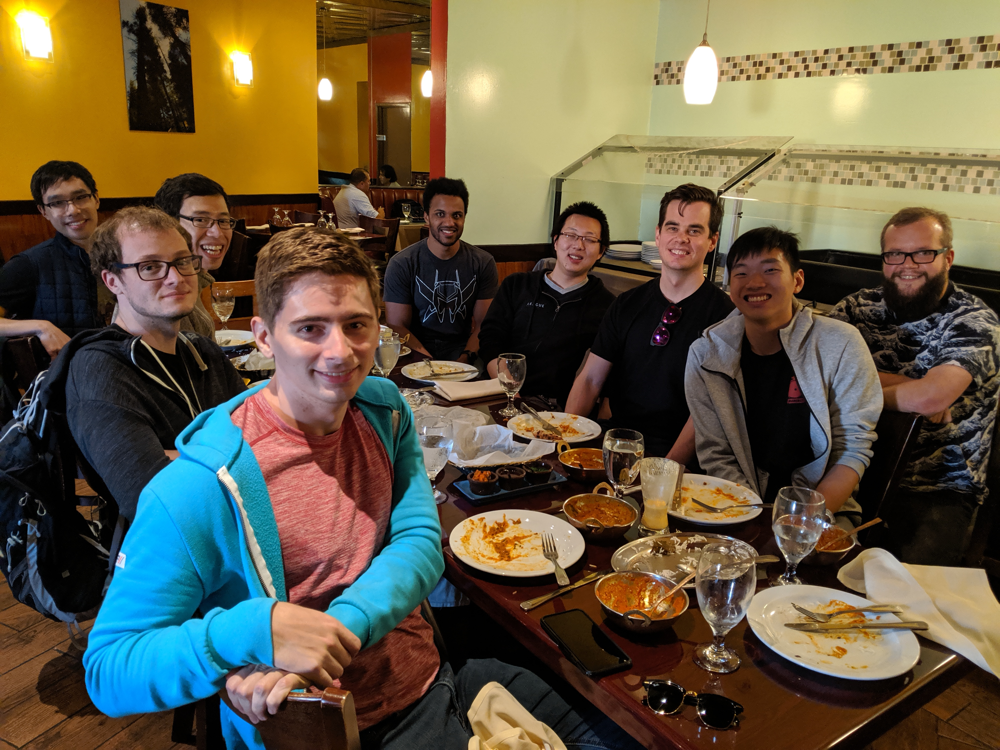 -->

I’d like to give thanks to the Foundations team or the rpg-pp-pp-sdk team for an amazing summer. You guys are awesome and were dealing with some intense deadlines (probably even now) so goodluck and I wish y’all the best for the exciting times to come.

## Conclusion
If people ask me what was the best part about working at Riot? It’s definitely the people. Everyone I’ve met just seems to care. They care about what they do, they care about having fun, they care about where they want to go. Most of all, it’s a place that I feel like I’d never have to worry about caring too much, never have to worry about being too passionate about what I do or where I want to go. The feedback culture is real. People are open to talking about anything and everything and I’ve learned more from others than any of my other internships, and got to interact with some very experienced and meticulous engineers. Through it all, I reconnected with an important part of me that I never even thought I neglected. It reignited my desire to pursue whatever that I want to do.

<figure>
  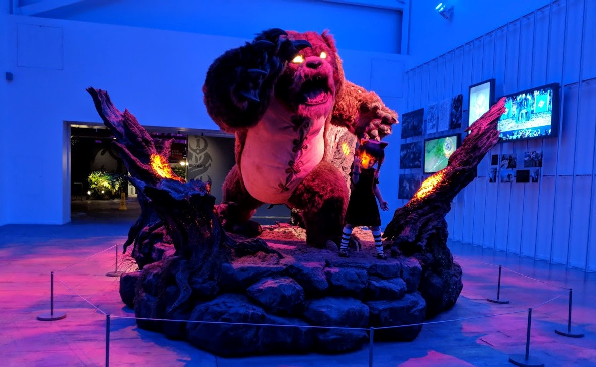
  <figcaption align="center"><i>Ever wondered what Annie looks like in the dark?</i></figcaption>
</figure>

To everyone who I’ve talked to at Riot, thanks for an amazing summer! It was awesome getting to know each and every one of you. Thank you to all those who lend me their time in our 1:1s. You guys inspire me to keep pursuing my passion one step at a time. To all the interns, you guys are so talented even on stuff that isn't your job and I know you will keep being awesome wherever you decide to go.

**Update:** That’s why I’ve decided to come back this summer to join Project L! I look forward to meeting even more awesome and talented people and get to finally experience what it is like working on a game team!
